# Topic-Wise Javascript Interview Questions & Answers 🌹 [](https://github.com/nikhilrstg18/iq/blob/master/LICENSE.md)  

> Click :star: if you like the project. Pull Requests are highly appreciated.

> [](https://twitter.com/rustagi_nikhil) for technical updates.

---

## Disclaimer

The questions provided in this repository are the summary of frequently asked questions across numerous companies. We cannot guarantee that these questions will actually be asked during your interview process, nor should you focus on memorizing all of them. The primary purpose is for you to get a sense of what some companies might ask — do not get discouraged if you don't know the answer to all of them ⁠— that is ok!

Good luck with your interview 😊
---
# Table of Topics
| #                  | Topic                                                                                                                                                                                                                                                                                                                                                                                                                                                                                                                                                                                                                                                                                                                                                                                                                                                                                                                                                                                                                                                                                                                                                                                                                                                                                                                                                                                                                                                                                                                                                                                                                     |
| ------------------ | ------------------------------------------------------------------------------------------------------------------------------------------------------------------------------------------------------------------------------------------------------------------------------------------------------------------------------------------------------------------------------------------------------------------------------------------------------------------------------------------------------------------------------------------------------------------------------------------------------------------------------------------------------------------------------------------------------------------------------------------------------------------------------------------------------------------------------------------------------------------------------------------------------------------------------------------------------------------------------------------------------------------------------------------------------------------------------------------------------------------------------------------------------------------------------------------------------------------------------------------------------------------------------------------------------------------------------------------------------------------------------------------------------------------------------------------------------------------------------------------------------------------------------------------------------------------------------------------------------------------------- |
| 1. Getting Started | [**What**? **Why**? **When**? **Who**? **Where**? **How**? about JS](#what-why-when-who-where-how-about-js)                                                                                                                                                                                                                                                                                                                                                                                                                                                                                                                                                                                                                                                                                                                                                                                                                                                                                                                                                                                                                                                                                                                                                                                                                                                                                                                                                                                                                                                                                                               |
| Topics Covered     | [1.1 Understanding **JS Engine**](#understanding-js-engine) <br/>[1.1.1 Inside JS Engine](#inside-js-engine)<hr />[1.2 Understanding **Heap**](#understanding-heap) <br/>[1.2.1 Memory Leaks](#memory-leaks)<hr /> [1.3 Understanding **Call stack**](#understanding-call-stack) <br/>[1.3.1 Stack Overflow](#stack-overflow) <br />[1.3.2 Garbage Collection](#garbage-collection) <br /> [1.3.3  Single-threaded](#single-threaded) <hr />[1.4 Understanding **JS Runtime**](#understanding-js-runtime) <br/>[1.4.1 JS Engine](#js-engine) <br/>[1.4.2 Browser Web API (window)](#browser-web-api)<br/>[1.4.3 Event Loop and Callback Queue](#event-loop-and-callback-queue)                                                                                                                                                                                                                                                                                                                                                                                                                                                                                                                                                                                                                                                                                                                                                                                                                                                                                                                                            |
| 2. Grammer         | [**JS Basics**](#js-grammer)                                                                                                                                                                                                                                                                                                                                                                                                                                                                                                                                                                                                                                                                                                                                                                                                                                                                                                                                                                                                                                                                                                                                                                                                                                                                                                                                                                                                                                                                                                                                                                                              |
| Topics Covered     | [2.0 **Comments**](#comments)<hr />[2.1 **Operators**](#operators)<br/>[2.1.1 Unary](#unary)<br/>[2.1.2 Binary](#binary)<br/>[2.1.3 Ternary or Conditional](#ternary-or-conditional) <br/>[2.1.4 Assignment](#assignment)<br/>[2.1.5 Comparison](#comparison)<br/>[2.1.6 Arithmatic](#arithmatic)<br/>[2.1.7 Bitwise](#bitwise)<br/>[2.1.8 Logical](#logical)<br/>[2.1.9 Misc](#misc)<hr /> [2.2 **Expressions**](#expressions) <hr />[2.3 **Data Types**](#data-types) <hr />[2.4 **Type Conversion and Coercion**](#types-conversion--coercion)                                                                                                                                                                                                                                                                                                                                                                                                                                                                                                                                                                                                                                                                                                                                                                                                                                                                                                                                                                                                                                                                         |
| 3. Concepts        | [**JS Fundamentals**](#what-why-when-who-where-how-about-js)                                                                                                                                                                                                                                                                                                                                                                                                                                                                                                                                                                                                                                                                                                                                                                                                                                                                                                                                                                                                                                                                                                                                                                                                                                                                                                                                                                                                                                                                                                                                                              |
| Topics Covered     | 3.1 **Declarations & Statements**<hr />Declaring Variables <br/>3.1.1 `var`<br/>3.1.2 `let`<br/>3.1.3 `const` <hr/>Declaring functions & classes <br/>3.2.1 `function`<br/>3.2.2 `function*`<br/>3.2.3 `async function`<br/>3.2.4 `async function*`<br/>3.2.5 `class` <hr/>Control Flow Statements<br/>3.3.1 `return`<br/>3.3.2 `break`<br/>3.3.3 `continue`<br/>3.3.4 `throw`<br/>3.3.5 `if...else`<br/>3.3.6 `switch` <br/>3.3.7 `try...catch`  <hr/>Looping Statements <br/>3.4.1 `while`<br/>3.4.2 `do-while`<br/>3.4.3 `for`<br/>3.4.4 `for...in`<br/>3.4.5 `for...of`<br/>3.4.6 `for await...of`<hr/>Misc. Statements <br/>3.5.1 `empty`<br/>3.5.2 `block`<br/>3.5.3 `debugger`<br/>3.5.4 `export`<br/>3.5.5 `import`<br/>3.5.6 `label`<br/>3.5.7 `with`<hr/> 3.2 **Execution Context** <hr/>3.3 **Lexical Environment** <hr/>3.4 **Scope** & **scope chain**<br/>3.4.1 Understanding Scope-Chain <br/>3.4.2 Understanding Scope [[scope]]<br/>3.4.3 Lexical scope Vs Dynamic scope <br/>3.4.4 Leakage of global variable & 'use strict'<br/>3.4.5 Concept of Currying<hr/>3.5 **Hoisting**<br/>3.5.1 function declaration Vs function expression <br/>3.5.2 Variable Hoisting (**`var`**) <br/>3.5.3 Function Hoisting (**`function`**) <hr/>3.6 **Function Invokation**<hr/>3.7 Understanding **`this`** - **`call()`**- **`apply()`**- **`bind()`**-<br/>3.7.1 **`this`** w.r.t. dynamic & lexical scope <br/>3.7.2 **`call()`** & **`apply()`** <br/>3.7.3 **`bind()`**<hr/>3.8 **Global variable** & **IFFE**<br/>3.8.1 Global Variable and its usage <br/>3.8.2 IFFE- Immediately Invoked Function Expression |


Good luck with your interview 😊

# What Why When Who Where How about JS
> **What is JS** ? 

JavaScript (JS) is a
- **dynamic** (aka loosley typed)
- **interpreted** or **compiled** (JIT compiled)
- **garbage-collected**
- **single-threaded**
- **multi-paradigm** (functional and object oriented)
- programming language with **functions as first-class citizens**.

  > Note: you will be able to elaborate and explain javascript with more clarity by end of this section
  
While it is most well-known as the scripting language for Web pages, many non-browser environments also use it, such as Node.js, Apache CouchDB and Adobe Acrobat. supporting object-oriented, imperative, and declarative (e.g. functional programming) styles. 

Read more @ [MDN](https://developer.mozilla.org/en-US/docs/Web/JavaScript)

---
> When and Who created JS?

In 1995, **Brendon Eich** created JS to add interactivity in legendary Netscape Navigator web browser.

---
> Why learn JS?

JS was popular, is popular and with its ongoing evolution JS will remain popular.\
See most popular technology @ [stackoverflow survey 2022](https://survey.stackoverflow.co/2022/#technology-most-popular-technologies)

---
> Where to use JS?

JS runs both in  and outside web browser.

---
> How JS works?

To understand how JS works, you need to understand 
- JS Engine 
- JS Runtime

**[⬆ Back to Topics](#table-of-topics)**

### **Understanding JS Engine**
---

Almost everyone who has worked with JS, as heard about JS Engine 
- JS is a single threaded language that uses callbacks or Callback-Queue
- JS is interpreted or compiled?


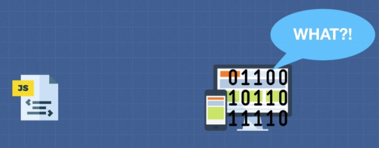

So if your write some English like statement/code in your JS file. And if you directly provide this JS file as input to your computer, it might raise a flag that it does understand JS language.

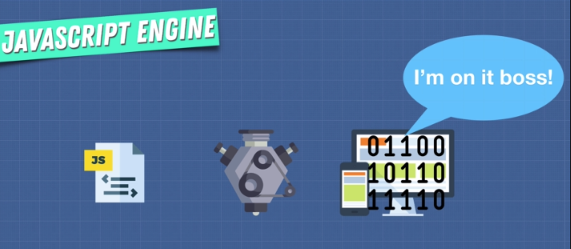

JS engine is going to take it as input and convert it to output that is more familiar for a machine (machine code)

concepts covered
- Inside JS Engine (Google's V8)
- Heap
- Call stack
---

#### **Inside JS Engine**

So, we learnt that JS Engine is the one who takes our JS file/code and converts that to machine code to be understandable by machine
Let's look inside popular engine used by chrome and nodejs i.e. Google's V8 JS Engine

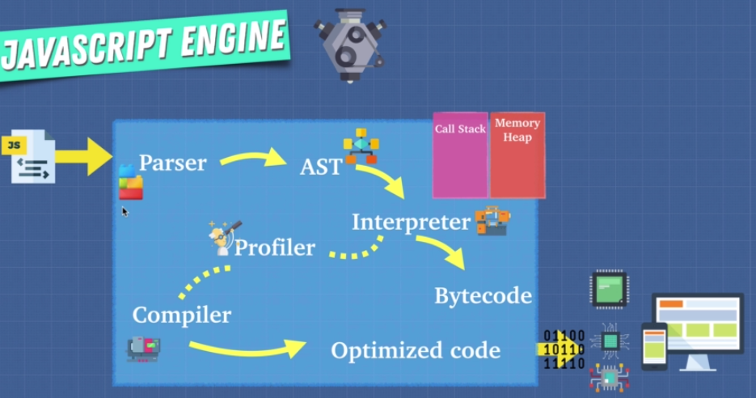

So when you give a JS file to JS engine to run it

- **Parser**: It performs lexical analysis, which breaks the code into something called tokens based JS grammar /keywords to identify the meaning of code to determine what code is trying to do

- **AST**: These tokens then forms an AST (Abstract Syntax Tree). Tool > https://astexplorer.net/
AST looks gibberish to Human but it allows JS Engine to understand what code is trying to do

- **Interpreter**: Translate the source code into machine code, does it by reading line by line execute it. Of course, the source code still needs to be converted into machine code, but it simply happens right before it’s executed and not ahead of time
  
    

    for eg 
    ```javascript
    function someCalculation(x y){
        return x + y;
    }
    for(let i = 0; I < 1000; i++){
        someCalculation(5,4);
    }
    ```
  Interpreter starts reading the source code from top to bottom
  first it read line 1 and understands that the function **`someCalculation`** is declared and then line 2 then line 3 and understands the function body and finally executes it before jumping to line 4 

  and at line it reads for keyword and understands that the for   loop is declared follows be reading line 4 and line 6 and understands the expression that it need to iterate and finally executes for-loop before jumping to next line of the source code (which EOF in our case)

  then for each iteration of loop its going to execute line 1 then line 2 then line 3. 

  > **Note** in this approach even though result of someCalculation remains same it execute the function for each iteration

- **Profiler**: Covered in next topic

- **Compiler**: Translate the source code into machine code, does it by reading source code in one go and execute it i.e. Compiler works ahead of time to create a translation of the source code which is translated into bytecode(closely related to machine code i.e. understandable my machine)

    

    for eg

    Input to compiler ( source code in one go )

    ```javascript
    function someCalculation(x y){
        return x + y;
    }

    for(let i = 0; I < 1000; i++){
        console.log(someCalculation(5,4));
    }

    ```

    output of compiler ( optimized bytecode )

    ```javascript
    function someCalculation(x y){
        return x + y;
    }

    for(let i = 0; I < 1000; i++){
        console.log(9));
    }
    ```

  > Interpreter or compiler ?

  Both have their pros and cons
  | Interpeter                                                                                       | Compiler                                                                                   |
  | ------------------------------------------------------------------------------------------------ | ------------------------------------------------------------------------------------------ |
  | Faster to get up and running                                                                     | Slower to get up and running                                                               |
  | But it get slower in execution as it doesn't do any kind of optimization in case of huge JS code | But it is faster in execution as it does some sort of optimization in case of huge JS code |

**Can we have best of both worlds ?** \
JIT compiler, Let's understand how Google's v8 engine does this


Initially

Source code -> **Parse** -> **AST** -> **Interpreter** -> **bytecode** (aka ignition i.e. to execute our code asap) 

- **Profiler**: Monitors and watches the code as it runs and makes notes on how we can optimize this code : how many times it has been run? what types are used? How possible optimize this?

  Now as the bytecode from interpreter is running, a copy of source code is given to compiler along with the optimization notes from profiler and generates optimized bytecode. 

  This means the JS code given to v8 engine is going to gradually improve because profiler and compiler are constantly improving bytecode as the app is running i.e. why called as JIT compiler

  Finally it mixes and matches or replace bytecode from interpreter with optimized bytecode from compiler to run on machine and this constantly run through this loop 
  Compiler as the app is running, takes the bytecode

  - **Interpreter** JS is interpreted ? \
  Yes, Initially when JS first came out, JS engine like SpiderMonkey created by Brendon Eich that interpreted JS to bytecode and that engine was able to run inside our browser to tell our computers what to do. But things are evolved now to use profiler and compiler aka JIT compiler to optimize this code 
	
  - **Compiler** JS is compiled? \
  Yes, it depends on the implementation of modern JS Engine

  - **JIT Compiler** JS is JIT compiled? \
  Yes, eg v8 engine by google
---


So far we learnt that JS Engine does a lot of work for us, but more important thing is reading our code and executing it which has 2 most important steps
- Heap 
- Call Stack

**[⬆ Back to Topics](#table-of-topics)**

#### **Understanding Heap**
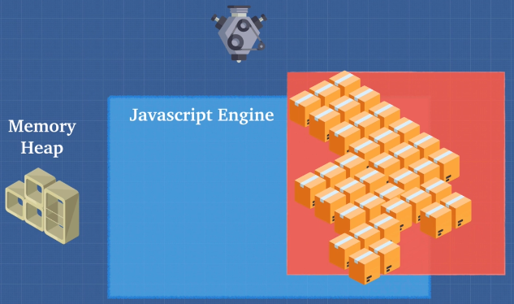

Place to store and write information (variables, objects, etc) --> Memory Heap --> used by JS engine for memory allocation

```javascript
const number = 100; // allocate memory for number
const string = "hi" // allocate memory for string
const human = {     // allocate memory for object ...and its values
    name:'Nikhil',
    age:28
}
```
##### **Memory Leaks**
eg. 
```javascript
var array = [];
for(var i = 5; i>1 ; i++){
    array.push(i-1);
}
```

Execute above code in console tab of dev tools in chrome and see what happens 

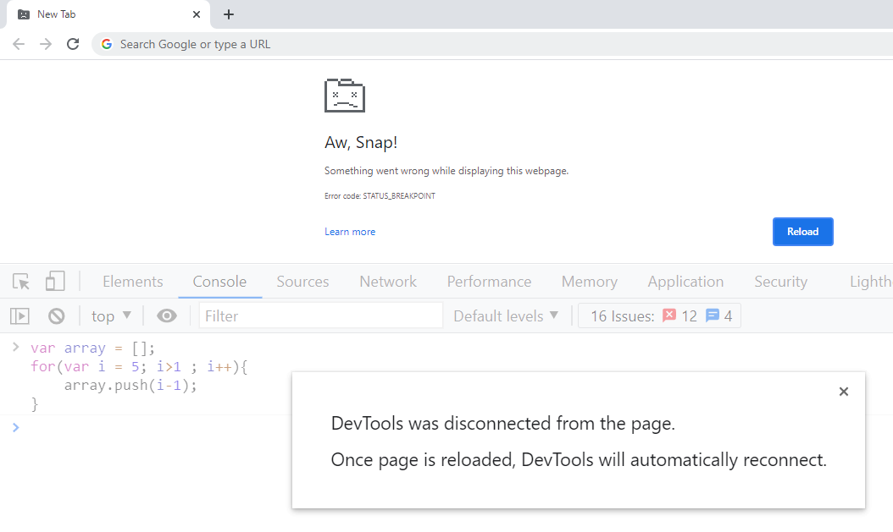


3 common memory leaks with eg

```javascript
// global variables
var a = 1;
var b = {
    name:'Nikhil'
}

// adding event listeneners and not removing it
var element = document.getElementById('button');
element.addEventListener('click', ()=>{})

// variables or objects referenced in callback of setInterval
setInterval(()=>{
    // referencing object... 
    // these objects are never garbage collected...
}, 1000);
```
**[⬆ Back to Topics](#table-of-topics)**

#### **Understanding Call Stack** 
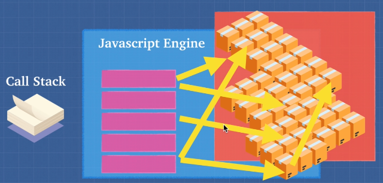

Place to store and keep track of what happening line by line on our code --> Call Stack - used by JS engine to keep track of where you code is, in execution
```javascript
function subtractTwo(num){
    return num-2;
}

function calc(){
    var sum = 5+4;
    return subtractTwo(sum);
}
debugger
calc();

```
- Run above code as snippet in Source tab of Developer console of chrome
  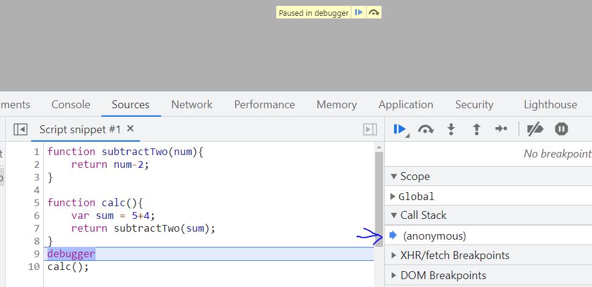
- Notice when you execute script with debugger, script paused on debugger and even before calc function is called, there is something in the call stack named--> anonymous aka Global Execution Context which is something that will discuss in later topics
  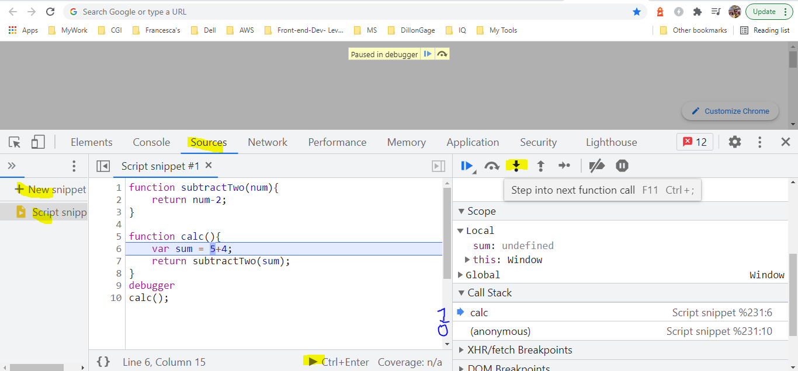
- When you press F11 Step into, calc method is pushed into call stack
  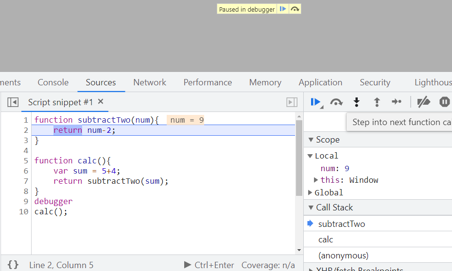
- When you press F11 step into 2 times, subtractTwo method is also pushed into call stack
  > Note : We are not done executing calc() instead calc() called subtractTwo() and call stack is keep track of execution of code. Clearly looking at call stack, I can say that we are subtractTwo().

  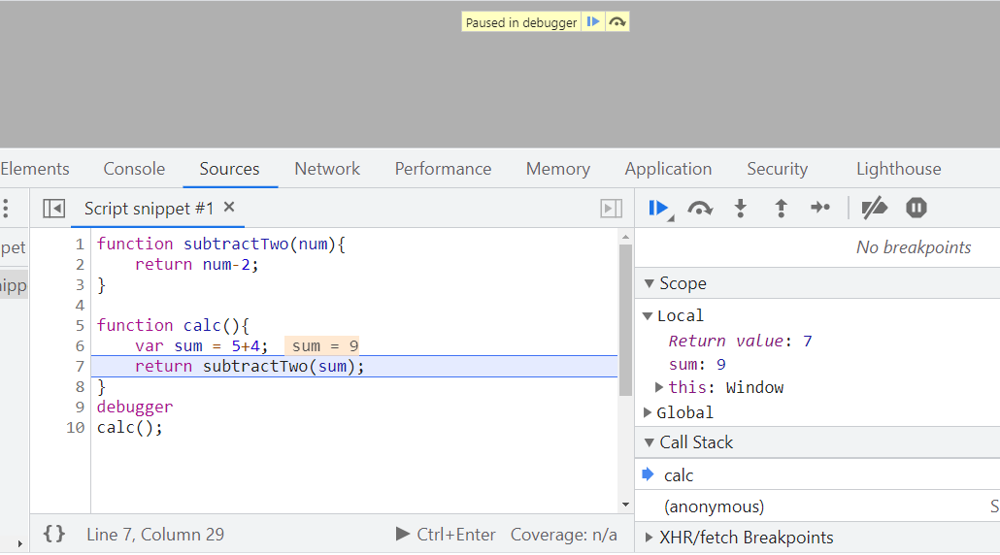
- When you press F11 step into 2 times, subtractTwo method is done executing and popped out from call stack
  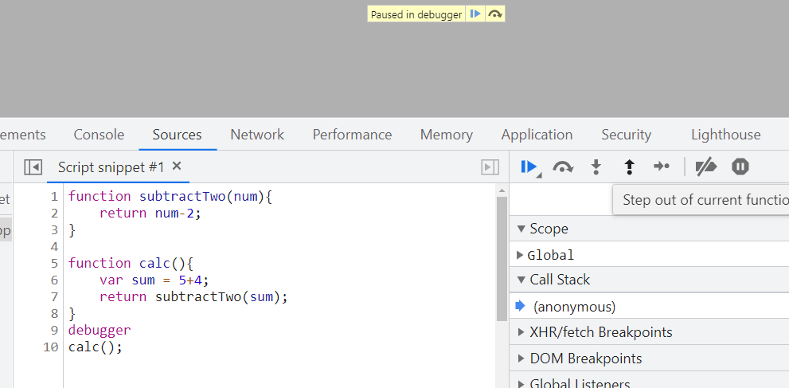
- When you press F11 step into again, calc method is done executing and popped out from call stack
- Finally you can press F8 ( resume script execution )

##### **Stack Overflow** 
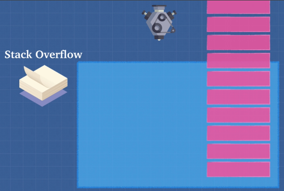

Most common way to create stack overflow is using recursion
For eg

```javascript
function inception(){
    inception();
}
inception();
```
Execute above code in console tab in dev tools in chrome

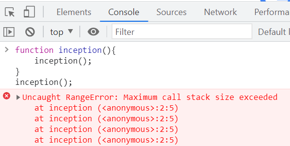

##### **Garbage Collection** 

- JS is garbage collected language.
  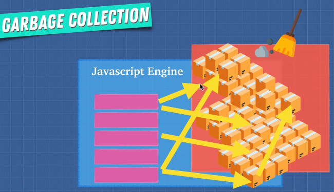
- When JS allocates memory i.e. within a function we created object, object get stored somewhere in out memory heap, automatically when JS finish executing my function and let's say we don't want that object anymore
- JS is going to automatically clean it up for us and free up the memory heap So only the data that's useful to us i.e. my program is still referring to will remain. This makes sure that we don't use all the memory that is available as we know memory is limited
- So in garbage collected language like JS, garbage collector frees up the heap memory and prevents what we call memory leaks

❓ *Does that mean you completely rely on garbage collector for heap memory management?*

❓ *How Garbage collection works in JS?*

It works on Mark and Sweep algorithm

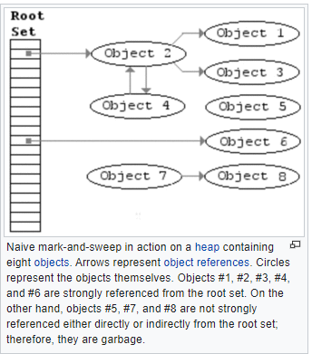

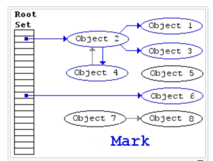

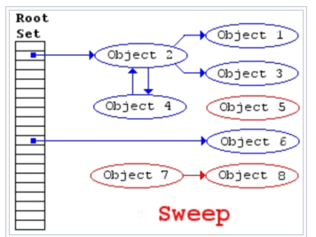

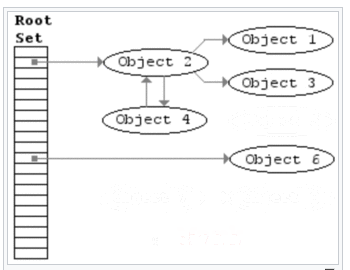

eg 1.
```javascript
1. var human = {     
2.    name:'Nikhil',
3.    age:28
4. }
5. human = 5;
```
  >The object is no longer referenced by `human` variable that makes it eligible for garbage collection after code at line 5 is executed

eg 2.
```javascript
function logHuman(){
    var human = {     
        name:'Nikhil',
        age:28
    }
    console.log(human)
}
```
  > Once `logHuman()` is done executing, object referenced by human variable is eligible for garbage collection
other way, we can say scope for human object is over after execution of `logHuman()`

##### **Single-threaded**

Being single threaded means that only one set of instruction is executed at a time, it is not doing multiple things
Reason of being single threaded --> is that it has only 1 call stack.

❓ *What is the issue with Single threaded language?*

eg

```javascript
alert('This is long running synchronous script - blocking interactivity untill callstack is empty ');
```

Run above code in console tab in dev tools of chrome

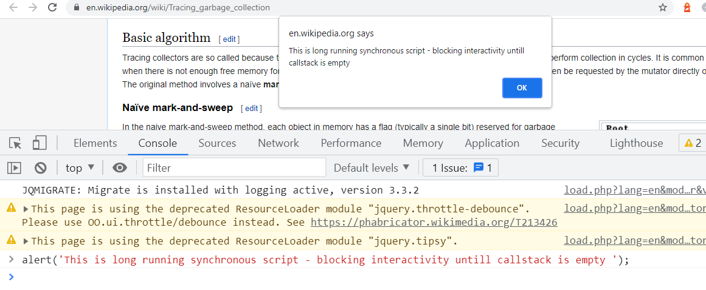

❓ *Why would anyone would like to block their application?*
❓ *So don’t you think, synchronous behavior of JS makes it less popular?*

Most of the time you won't be directly accessing of using JS Engine (which is synchronous). 
We need to introduce the idea of async code.
It's not only the JS engine executing our code but the JS Runtime (NodeJS implements something similar) which beyond just JS Engine 

**[⬆ Back to Topics](#table-of-topics)**

### **Understanding JS Runtime**

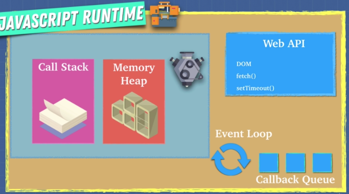

To overcome single threaded nature of JS, JS Runtime came into picture. 

JS Runtime comprises 3 main components

---
1. #### **JS Engine**
2. #### **Browser Web API**
  These are application that can do variety of things like send Http request, listen to DOM events (click, change), setTimeout, localStorage sessionStoage, indexedDB etc) - all are async operations.
  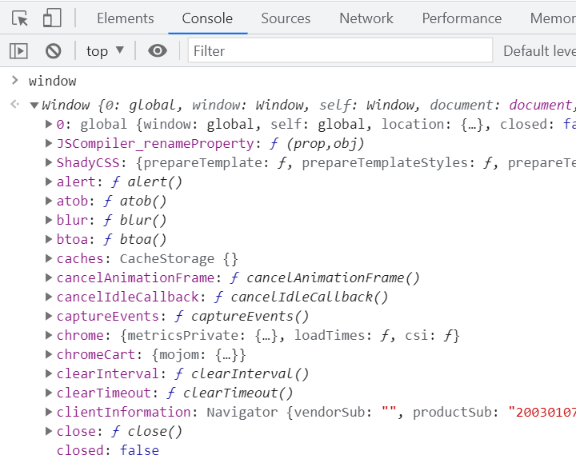 
  So browsers, make use of LLL like c++ instead of JS Engine and blocking the thread to perform these async operations in the background and these APIs are called Web APIs (which are asynchronous, meaning they do something in background and return the data back to JS Engine)

3. #### **Event Loop** and **Callback Queue**

JS runtime in action

--- 

- We have items on the call stack and as soon as something comes up like setTimeout i.e. not part of JS but part of Web API

- Call Stack is going to say "I have something that is not here for me, its for the web browser (web api). So its says hey web API this is something for you, I don't know what to do with this, please take care of it" and Web API is going to say "Ahh I know that to do with setTimeout, let me take care of it and do that in the background" 

- Once the (setTimeout ) async operation is served by Web API, it will push the data (usually a callback) of async operation into Callback Queue 

- Event Loop continuously checks if there is any callback in the Callback Queue and the Call Stack is empty or not, If Call Stack is empty then Event loop is going to pop the callback from Callback Queue and push it into Call Stack and now JS Engine execute it.

eg1a
```javascript
console.log('1');
setTimeout(()=> console.log('2'), 3000)
console.log('3');
```
    o/p
    1
    3
    2


eg1b
```javascript
console.log('1');
setTimeout(()=> console.log('2'), 0)
console.log('3');
```

    o/p
    1
    3
    2


eg2

👉 [Latent Flip tool](http://latentflip.com/loupe/?code=ZnVuY3Rpb24gYWNoaWV2ZUNob2NvbGF0ZSgpew0KICAgIGNvbnNvbGUubG9nKCdZb3UgYWNoaWV2ZWQgQ2hvY29sYXRlJyk7DQp9DQpmdW5jdGlvbiBjKCl7DQogICAgc2V0VGltZW91dChhY2hpZXZlQ2hvY29sYXRlLCAzMDAwKTsNCn0NCmZ1bmN0aW9uIGIoKXsNCiAgICBjKCk7DQp9DQpmdW5jdGlvbiBhKCl7DQogICAgYigpOw0KfQ0KYSgpOw%3D%3D!!!PGJ1dHRvbj5DbGljayBtZSE8L2J1dHRvbj4%3D)

and paste

```javascript

function achieveChocolate(){
    console.log('You achieved Chocolate');
}
function c(){
    setTimeout(achieveChocolate, 3000);
}
function b(){
    c();
}
function a(){
    b();
}
```

❓ *Explain briefly **JS** Vs **JS Engine** Vs **JS Runtime**?*

JS > Musical Notes

JS Engine    > Music Composer

JS Runtime > Music Orchestra 

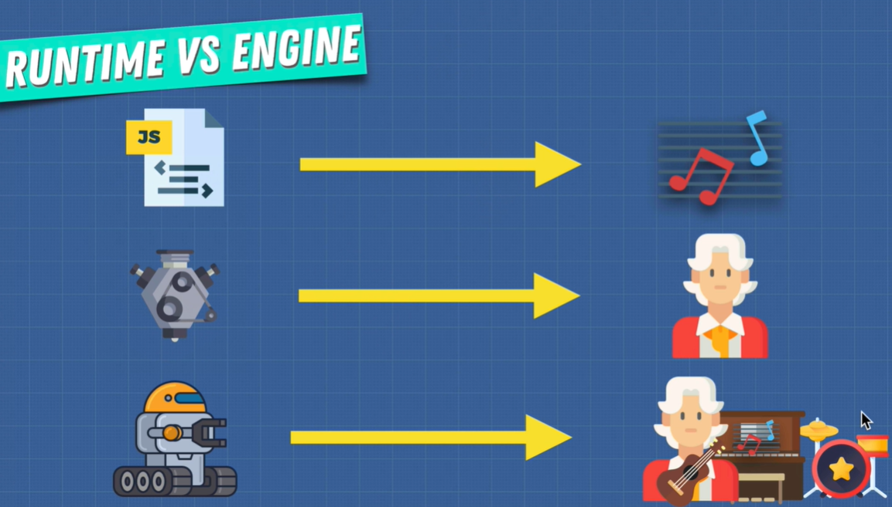 

**[⬆ Back to Topics](#table-of-topics)**


---

## JS Grammer


---
### Comments

- Comments behave like whitespace, and are discarded during script execution.
- Comments on method, exremely powerfull in describing purpose of method and documentation
- Comments on property, exremely powerfull in describing purpose of property and documentation

| Comment Type        | Example                                                     |
| ------------------- | ----------------------------------------------------------- |
| single-line comment | `// a one line comment`                                     |
| multi-line comment  | `/* this is a longer, `<br/>`* multi-line comment`<br/>`*/` |
| nested comment      | `/* You can't, however, /* nest comments */ SyntaxError */` |

> You might also see a third type of comment syntax at the start of some JavaScript files, which looks something like this: `#!/usr/bin/env node.` \
> This is called hashbang comment syntax, and is a special comment used to specify the path to a particular JavaScript engine that should execute the script. See Hashbang comments for more details.

**[⬆ Back to Topics](#table-of-topics)**

---
### Operators
---
#### Unary

Operators that operate on single operand

| Name           | Operator | Meaning                                                                                                                                                                                                             | Examples                                                                                           |
| -------------- | -------- | ------------------------------------------------------------------------------------------------------------------------------------------------------------------------------------------------------------------- | -------------------------------------------------------------------------------------------------- |
| Unary Plus     | +        | Attempts to convert the operand to a number, if it is not already <br /> eg. (+"3" returns 3) , (+true returns 1) 1                                                                                                 | [View](https://developer.mozilla.org/en-US/docs/Web/JavaScript/Reference/Operators/Unary_plus)     |
| Increment      | ++       | Adds one to its operand. <br/>If used as a prefix operator (++x), returns the value of its operand after adding one; if used as a postfix operator (x++), returns the value of its operand before adding one        | [View](https://developer.mozilla.org/en-US/docs/Web/JavaScript/Reference/Operators/Increment)      |
| Decrement      | --       | Subtracts one from its operand. <br/>If used as a prefix operator (--x), returns the value of its operand after adding one; if used as a postfix operator (x--), returns the value of its operand before adding one | [View](https://developer.mozilla.org/en-US/docs/Web/JavaScript/Reference/Operators/Decrement)      |
| Unary Negation | -        | Returns the negation of its operand <br />eg. if x is 3, then -x returns -3                                                                                                                                         | [View](https://developer.mozilla.org/en-US/docs/Web/JavaScript/Reference/Operators/Unary_negation) |

**[⬆ Back to Topics](#table-of-topics)**

---
#### Binary Unary Binary

Operator that operate on two operands like [Arithematic Operators](#arithmatic-operators)

**[⬆ Back to Topics](#table-of-topics)**

---
#### Ternary or Conditional 

operator that takes three operands

| Name                   | Operator | Meaning                                                                                                                                                                                                                                                                                                                            | Examples                                                                                                 |
| ---------------------- | -------- | ---------------------------------------------------------------------------------------------------------------------------------------------------------------------------------------------------------------------------------------------------------------------------------------------------------------------------------- | -------------------------------------------------------------------------------------------------------- |
| Ternary or Conditional | ? :      | is the only operator that takes three operands: a condition followed by a question mark (?), then an expression to execute if the condition is truthy followed by a colon (:), and finally the expression to execute if the condition is falsy. <br />This operator is frequently used as an alternative to an if...else statement | [View](https://developer.mozilla.org/en-US/docs/Web/JavaScript/Reference/Operators/Conditional_Operator) |

**[⬆ Back to Topics](#table-of-topics)**

---
#### Assignment
| Name                                                     | Shorthand operator                                                                                                                                                                                                                                                                                                                                                                                                                                                                                          | Meaning                                                                                     | Examples                                                                                                            |
| -------------------------------------------------------- | ----------------------------------------------------------------------------------------------------------------------------------------------------------------------------------------------------------------------------------------------------------------------------------------------------------------------------------------------------------------------------------------------------------------------------------------------------------------------------------------------------------- | ------------------------------------------------------------------------------------------- | ------------------------------------------------------------------------------------------------------------------- |
| Assingment                                               | x = y                                                                                                                                                                                                                                                                                                                                                                                                                                                                                                       | x = y                                                                                       | [View](https://developer.mozilla.org/en-US/docs/Web/JavaScript/Reference/Operators/Assignment)                      |
| Addition Assignment                                      | x += y                                                                                                                                                                                                                                                                                                                                                                                                                                                                                                      | x = x + y                                                                                   | [View](https://developer.mozilla.org/en-US/docs/Web/JavaScript/Reference/Operators/Addition_assignment)             |
| Subtraction Assignment                                   | x -= y                                                                                                                                                                                                                                                                                                                                                                                                                                                                                                      | x = x - y                                                                                   | [View](https://developer.mozilla.org/en-US/docs/Web/JavaScript/Reference/Operators/Subtraction_assignment)          |
| Multiplication Aassignment                               | x *= y                                                                                                                                                                                                                                                                                                                                                                                                                                                                                                      | x = x * y                                                                                   | [View](https://developer.mozilla.org/en-US/docs/Web/JavaScript/Reference/Operators/Multiplication_assignment)       |
| Division Aassignment                                     | x /= y                                                                                                                                                                                                                                                                                                                                                                                                                                                                                                      | x = x / y                                                                                   | [View](https://developer.mozilla.org/en-US/docs/Web/JavaScript/Reference/Operators/Division_assignment)             |
| **Remainder Aassignment**                                | x %= y                                                                                                                                                                                                                                                                                                                                                                                                                                                                                                      | x = x % y                                                                                   | [View](https://developer.mozilla.org/en-US/docs/Web/JavaScript/Reference/Operators/Remainder_assignment)            |
| **Exponentiation Assignment**                            | x **= y                                                                                                                                                                                                                                                                                                                                                                                                                                                                                                     | x = x ** y                                                                                  | [View](https://developer.mozilla.org/en-US/docs/Web/JavaScript/Reference/Operators/Exponentiation_assignment)       |
| **Left Shift Assignment**                                | x <<= y                                                                                                                                                                                                                                                                                                                                                                                                                                                                                                     | x = x << y                                                                                  | [View](https://developer.mozilla.org/en-US/docs/Web/JavaScript/Reference/Operators/Left_shift_assignment)           |
| **Right Shift Assignment**                               | x >>= y                                                                                                                                                                                                                                                                                                                                                                                                                                                                                                     | x = x >> y                                                                                  | [View](https://developer.mozilla.org/en-US/docs/Web/JavaScript/Reference/Operators/Right_shift_assignment)          |
| Unsigned Right Shift Assignment                          | x >>>= y                                                                                                                                                                                                                                                                                                                                                                                                                                                                                                    | x = x >>> y                                                                                 | [View](https://developer.mozilla.org/en-US/docs/Web/JavaScript/Reference/Operators/Unsigned_right_shift_assignment) |
| **Bitwise AND Assignment**<br/> (also used with boolean) | x &= y                                                                                                                                                                                                                                                                                                                                                                                                                                                                                                      | x = x & y                                                                                   | [View](https://developer.mozilla.org/en-US/docs/Web/JavaScript/Reference/Operators/Bitwise_AND_assignment)          |
| **Bitwise XOR Assignment**<br/> (also used with boolean) | x ^= y                                                                                                                                                                                                                                                                                                                                                                                                                                                                                                      | x = x ^ y                                                                                   | [View](https://developer.mozilla.org/en-US/docs/Web/JavaScript/Reference/Operators/Bitwise_XOR_assignment)          |
| **Bitwise OR Assignment**<br/> (also used with boolean)  | x &#124;= y                                                                                                                                                                                                                                                                                                                                                                                                                                                                                                 | x = x &#124; y                                                                              | [View](https://developer.mozilla.org/en-US/docs/Web/JavaScript/Reference/Operators/Bitwise_OR_assignment)           |
| Logical AND Assignment                                   | x &&= y                                                                                                                                                                                                                                                                                                                                                                                                                                                                                                     | x = x && (x = y)                                                                            | [View](https://developer.mozilla.org/en-US/docs/Web/JavaScript/Reference/Operators/Logical_AND_assignment)          |
| **Logical OR Assignment**<br/>(Shorting)                 | x &#124;&#124;= y                                                                                                                                                                                                                                                                                                                                                                                                                                                                                           | x = x &#124;&#124; (x = y)                                                                  | [View](https://developer.mozilla.org/en-US/docs/Web/JavaScript/Reference/Operators/Logical_OR_assignment)           |
| **Logical Nullish Assignment**                           | x ??= y                                                                                                                                                                                                                                                                                                                                                                                                                                                                                                     | x = x ?? (x = y)                                                                            | [View](https://developer.mozilla.org/en-US/docs/Web/JavaScript/Reference/Operators/Logical_nullish_assignment)      |
| **Destructring Assignment**                              | **Array Desctrucutring**<br/>`var foo =['one','two','three'];`<br />// without destructuring <br />var one = foo[0];<br />var two = foo[1];<br />var three = foo[2];<br />// with destructuring<br />**`var [one,two,three] = foo;`**<br/><br/>**Object Desctrucutring**<br/>`var bar ={one:'one',two:'two',three:'three'};`<br />// without destructuring <br />var one = bar.one;<br />var two = bar.two;<br />var three = bar.three;<br />// with destructuring<br />**var {one,two,three} = bar;**<br/> | `var [one,two,three] = foo;`<br/><br/><br/><br/><br/><br/><br/>`var {one,two,three} = bar;` | [View](https://developer.mozilla.org/en-US/docs/Web/JavaScript/Reference/Operators/Destructuring_assignment)        |

> Note: View atleast example of all highlighted operators

**[⬆ Back to Topics](#table-of-topics)**

---
#### Comparison
| Name                                  | Operator | Meaning                                                                                   | Examples                                                                                                           |
| ------------------------------------- | -------- | ----------------------------------------------------------------------------------------- | ------------------------------------------------------------------------------------------------------------------ |
| Equality                              | ==       | Returns true if the operands are equal                                                    | [View](https://developer.mozilla.org/en-US/docs/Web/JavaScript/Reference/Operators#equality)                       |
| Inequality                            | !=       | Returns true if the operands are not equal                                                | [View](https://developer.mozilla.org/en-US/docs/Web/JavaScript/Reference/Operators#inequality)                     |
| Identity <br/>(strict equality)       | ===      | Returns true if the operands are equal and of the same type                               | [View](https://developer.mozilla.org/en-US/docs/Web/JavaScript/Reference/Operators#identity)                       |
| Nonidentity <br/> (strict inequality) | !==      | Returns true if the operands are of the same type but not equal, or are of different type | [View](https://developer.mozilla.org/en-US/docs/Web/JavaScript/Reference/Operators#nonidentity)                    |
| Greater than                          | >        | Returns true if the left operand is greater than the right operand                        | [View](https://developer.mozilla.org/en-US/docs/Web/JavaScript/Reference/Operators#greater_than_operator)          |
| Greater Than Or Equal                 | >=       | Returns true if the left operand is greater than or equal to the right operand            | [View](https://developer.mozilla.org/en-US/docs/Web/JavaScript/Reference/Operators#greater_than_or_equal_operator) |
| Less Than                             | <        | Returns true if the left operand is less than the right operand.                          | [View](https://developer.mozilla.org/en-US/docs/Web/JavaScript/Reference/Operators#less_than_operator)             |
| Less Than Or Equal                    | <=       | Returns true if the left operand is less than or equal to the right operand.              | [View](https://developer.mozilla.org/en-US/docs/Web/JavaScript/Reference/Operators#less_than_or_equal_operator)    |

**[⬆ Back to Topics](#table-of-topics)**

---
#### Arithmatic
| Name           | Operator | Meaning                                                                                                                                                           | Examples                                                                                           |
| -------------- | -------- | ----------------------------------------------------------------------------------------------------------------------------------------------------------------- | -------------------------------------------------------------------------------------------------- |
| Remainder      | %        | Returns the integer remainder of dividing two operands <br/> It always takes the sign of the dividend                                                             | [View](https://developer.mozilla.org/en-US/docs/Web/JavaScript/Reference/Operators/Remainder)      |
| Division       | /        | Returns the integer quotient of dividing two operands                                                                                                             | [View](https://developer.mozilla.org/en-US/docs/Web/JavaScript/Reference/Operators/Division)       |
| Multiplication | *        | Returns the product of two operands                                                                                                                               | [View](https://developer.mozilla.org/en-US/docs/Web/JavaScript/Reference/Operators/Multiplication) |
| Addition       | +        | Returns the sum of two operands                                                                                                                                   | [View](https://developer.mozilla.org/en-US/docs/Web/JavaScript/Reference/Operators/Addition)       |
| Subtraction    | -        | Returns the difference of two operands                                                                                                                            | [View](https://developer.mozilla.org/en-US/docs/Web/JavaScript/Reference/Operators/Subtraction)    |
| Exponentiation | **       | Returns the result of raising the first operand to the power of the second operand <br />It is equivalent to Math.pow, except it also accepts BigInts as operands | [View](https://developer.mozilla.org/en-US/docs/Web/JavaScript/Reference/Operators/Exponentiation) |

**[⬆ Back to Topics](#table-of-topics)**

---
#### Bitwise

Operater operates on bit representation of operand. further classfies in to 2 more categories

---
##### Logical bitwise
| Name        | Operator | Meaning                                                                                                                                        | Examples                                                                                        |
| ----------- | -------- | ---------------------------------------------------------------------------------------------------------------------------------------------- | ----------------------------------------------------------------------------------------------- |
| Bitwise AND | &        | The bitwise AND operator ( & ) returns a 1 in each bit position for which the corresponding bits of both operands are 1s                       | [View](https://developer.mozilla.org/en-US/docs/Web/JavaScript/Reference/Operators/Bitwise_AND) |
| Bitwise OR  | &#124;   | The bitwise OR operator ( &#124; ) returns a 1 in each bit position for which the corresponding bits of either or both operands are 1s.        | [View](https://developer.mozilla.org/en-US/docs/Web/JavaScript/Reference/Operators/Bitwise_OR)  |
| Bitwise XOR | ^        | The bitwise XOR operator (^) returns a 1 in each bit position for which the corresponding bits of either but not both operands are 1s.         | [View](https://developer.mozilla.org/en-US/docs/Web/JavaScript/Reference/Operators/Bitwise_XOR) |
| Bitwise NOT | ~        | The bitwise NOT operator (~) inverts the bits of its operand. Like other bitwise operators, it converts the operand to a 32-bit signed integer | [View](https://developer.mozilla.org/en-US/docs/Web/JavaScript/Reference/Operators/Bitwise_NOT) |

**[⬆ Back to Topics](#table-of-topics)**

---
##### Shift bitwise
| Name        | Operator | Meaning                                                                                                                                                                                                  | Examples                                                                                        |
| ----------- | -------- | -------------------------------------------------------------------------------------------------------------------------------------------------------------------------------------------------------- | ----------------------------------------------------------------------------------------------- |
| Left Shift  | <<       | The left shift operator (<<) shifts the first operand the specified number of bits, modulo 32, to the left. Excess bits shifted off to the left are discarded. Zero bits are shifted in from the right   | [View](https://developer.mozilla.org/en-US/docs/Web/JavaScript/Reference/Operators/Left_shift)  |
| Right Shift | >>       | The right shift operator (<<) shifts the first operand the specified number of bits, modulo 32, to the right. Excess bits shifted off to the right are discarded. Zero bits are shifted in from the left | [View](https://developer.mozilla.org/en-US/docs/Web/JavaScript/Reference/Operators/Right_shift) |

**[⬆ Back to Topics](#table-of-topics)**

---
#### Logical
| Name                            | Operator     | Meaning                                                                                                                                                                                                                                                                                                                                                                                                                                      | Examples                                                                                        |
| ------------------------------- | ------------ | -------------------------------------------------------------------------------------------------------------------------------------------------------------------------------------------------------------------------------------------------------------------------------------------------------------------------------------------------------------------------------------------------------------------------------------------- | ----------------------------------------------------------------------------------------------- |
| Logical AND                     | &&           | The logical AND ( && ) operator (logical conjunction) for a set of boolean operands will be true if and only if all the operands are true. Otherwise it will be false.<br /> More generally, the operator returns the value of the first falsy operand encountered when evaluating from left to right, or the value of the last operand if they are all truthy.                                                                              | [View](https://developer.mozilla.org/en-US/docs/Web/JavaScript/Reference/Operators/Logical_AND) |
| Logical OR <br /> Short Circuit | &#124;&#124; | The logical OR ( &#124;&#124; ) operator (logical disjunction) for a set of operands is true if and only if one or more of its operands is true. It is typically used with boolean (logical) values. <br /> When it is, it returns a Boolean value. However, the &#124;&#124; operator actually returns the value of one of the specified operands, so if this operator is used with non-Boolean values, it will return a non-Boolean value. | [View](https://developer.mozilla.org/en-US/docs/Web/JavaScript/Reference/Operators/Logical_OR)  |
| Logical NOT                     | !            | The logical NOT (!) operator (logical complement, negation) takes truth to falsity and vice versa. It is typically used with boolean (logical) values.<br /> When used with non-Boolean values, it returns false if its single operand can be converted to true; otherwise, returns true.                                                                                                                                                    | [View](https://developer.mozilla.org/en-US/docs/Web/JavaScript/Reference/Operators/Logical_NOT) |

**[⬆ Back to Topics](#table-of-topics)**

---
#### Misc

| Name                                                                 | Operator   | Meaning                                                                                                                                                                                                                                                                                                                    | Examples                                                                                                        |
| -------------------------------------------------------------------- | ---------- | -------------------------------------------------------------------------------------------------------------------------------------------------------------------------------------------------------------------------------------------------------------------------------------------------------------------------- | --------------------------------------------------------------------------------------------------------------- |
| **instanceof**                                                       | instanceof | The instanceof operator tests to see if the prototype property of a constructor appears anywhere in the prototype chain of an object. The return value is a boolean value. Its behavior can be customized with Symbol.hasInstance.                                                                                         | [View](https://developer.mozilla.org/en-US/docs/Web/JavaScript/Reference/Operators/instanceof)                  |
| **typeof**                                                           | typeof     | The typeof operator returns a string indicating the type of the unevaluated operand.                                                                                                                                                                                                                                       | [View](https://developer.mozilla.org/en-US/docs/Web/JavaScript/Reference/Operators/typeof)                      |
| **this**                                                             | this       | The value of this is determined by how a function is called (runtime binding). It can't be set by assignment during execution, and it may be different each time the function is called.                                                                                                                                   | [View](https://developer.mozilla.org/en-US/docs/Web/JavaScript/Reference/Operators/this)                        |
| super                                                                | super      | The super keyword is used to access properties on an object literal or class's [[Prototype]], or invoke a superclass's constructor. <br />The super.prop and super[expr] expressions are valid in any method definition in both classes and object literals. The super(...args) expression is valid in class constructors. | [View](https://developer.mozilla.org/en-US/docs/Web/JavaScript/Reference/Operators/super)                       |
| void                                                                 | void       | The void operator evaluates the given expression and then returns undefined.                                                                                                                                                                                                                                               | [View](https://developer.mozilla.org/en-US/docs/Web/JavaScript/Reference/Operators/void)                        |
| null                                                                 | null       | The value null represents the intentional absence of any object value. It is one of JavaScript's primitive values and is treated as falsy for boolean operations.                                                                                                                                                          | [View](https://developer.mozilla.org/en-US/docs/Web/JavaScript/Reference/Operators/null)                        |
| in                                                                   | in         | The in operator returns true if the specified property is in the specified object or its prototype chain.                                                                                                                                                                                                                  | [View](https://developer.mozilla.org/en-US/docs/Web/JavaScript/Reference/Operators/in)                          |
| await                                                                | await      | The await operator is used to wait for a Promise. It can only be used inside an async function within regular JavaScript code; however it can be used on its own with JavaScript modules.                                                                                                                                  | [View](https://developer.mozilla.org/en-US/docs/Web/JavaScript/Reference/Operators/await)                       |
| delete                                                               | delete     | The JavaScript delete operator removes a property from an object; if no more references to the same property are held, it is eventually released automatically.                                                                                                                                                            | [View](https://developer.mozilla.org/en-US/docs/Web/JavaScript/Reference/Operators/delete)                      |
| new                                                                  | new        | The new operator lets developers create an instance of a user-defined object type or of one of the built-in object types that has a constructor function.                                                                                                                                                                  | [View](https://developer.mozilla.org/en-US/docs/Web/JavaScript/Reference/Operators/new)                         |
| **Nullish coalescing**                                               | ??         | returns its right-hand side operand when its left-hand side operand is null or undefined, and otherwise returns its left-hand side operand                                                                                                                                                                                 | [View](https://developer.mozilla.org/en-US/docs/Web/JavaScript/Reference/Operators/Nullish_coalescing_operator) |
| **Optional Chaining** <br />or **Elvis** <br />or **Safe traversal** | ?.         | The ?. operator is like the . chaining operator, except that instead of causing an error if a reference is nullish (null or undefined), the expression short-circuits with a return value of undefined.<br /> When used with function calls, it returns undefined if the given function does not exist                     | [View](https://developer.mozilla.org/en-US/docs/Web/JavaScript/Reference/Operators/Optional_chaining)           |

**[⬆ Back to Topics](#table-of-topics)**

---
### Expressions
| Name                | Expression          | Meaning                                                                                                                                                                                                                                                                                                          | Examples                                                                                     |
| ------------------- | ------------------- | ---------------------------------------------------------------------------------------------------------------------------------------------------------------------------------------------------------------------------------------------------------------------------------------------------------------- | -------------------------------------------------------------------------------------------- |
| class expression    | class expression    | The class expression is one way to define a class. Similar to function expressions, class expressions can be named or unnamed. If named, the name of the class is local to the class body only.                                                                                                                  | [View](https://developer.mozilla.org/en-US/docs/Web/JavaScript/Reference/Operators/class)    |
| function expression | function expression | The function keyword can be used to define a function inside an expression.<br />You can also define functions using the Function constructor and a function declaration.                                                                                                                                        | [View](https://developer.mozilla.org/en-US/docs/Web/JavaScript/Reference/Operators/function) |
| regular expression  | regular expression  | Regular expressions are patterns used to match character combinations in strings. In JavaScript, regular expressions are also objects. These patterns are used with the exec() and test() methods of RegExp, and with the match(), matchAll(), replace(), replaceAll(), search(), and split() methods of String. | [View](https://developer.mozilla.org/en-US/docs/Web/JavaScript/Guide/Regular_Expressions)    |

---

### Data Types
The set of types in the JavaScript language consists of **primitive values** and **objects**.

#### Primitive values (immutable datum represented directly at the lowest level of the language)
 - `Boolean` -> type represents a logical entity and can have two values: true and false
 - `Null` -> type has exactly one value: null
 - `Undefined` -> A variable that has not been assigned a value has the value undefined
 - `Number` -> type is a double-precision 64-bit binary format IEEE 754 value. It is capable of storing positive floating-point numbers between 2^-1074 (Number.MIN_VALUE) and 2^1024 (Number.MAX_VALUE) as well as negative floating-point numbers between -(2^-1074) and -(2^1024), but it can only safely store integers in the range -(2^53 − 1) (Number.MIN_SAFE_INTEGER) to 2^53 − 1 (Number.MAX_SAFE_INTEGER).

    > You can check if a number is within the range of safe integers using Number.isSafeInteger(). Outside the range from Number.MIN_SAFE_INTEGER to Number.MAX_SAFE_INTEGER, JavaScript can no longer safely represent integers; they will instead be represented by a double-precision floating point approximation.

    Values outside the range ±(2^-1074 to 2^1024) are automatically converted:

    - Positive values greater than Number.MAX_VALUE are converted to +Infinity.
    - Positive values smaller than Number.MIN_VALUE are converted to +0.
    - Negative values smaller than -Number.MAX_VALUE are converted to -Infinity.
    - Negative values greater than -Number.MIN_VALUE are converted to -0.

    +Infinity and -Infinity behave similarly to mathematical infinity, but with some slight differences; see Number.POSITIVE_INFINITY and Number.NEGATIVE_INFINITY for details.

    The Number type has only one integer with multiple representations: 0 is represented as both -0 and +0 (where 0 is an alias for +0). In practice, there is almost no difference between the different representations; for example, +0 === -0 is true. However, you are able to notice this when you divide by zero:

    ```javascript
    console.log(42 / +0); // Infinity
    console.log(42 / -0); // -Infinity
    ```
    Although a number often represents only its value, JavaScript provides binary (bitwise) operators.

 - `BigInt` -> type is a numeric primitive in JavaScript that can represent integers with arbitrary precision. With BigInts, you can safely store and operate on large integers even beyond the safe integer limit for Numbers.

    A BigInt is created by appending n to the end of an integer or by calling the constructor.

    You can obtain the largest safe value that can be incremented with Numbers by using the constant Number.MAX_SAFE_INTEGER. With the introduction of BigInts, you can operate with numbers beyond the Number.MAX_SAFE_INTEGER.

    This example demonstrates, where incrementing the Number.MAX_SAFE_INTEGER returns the expected result:

    ```javascript
    // BigInt
    const x = BigInt(Number.MAX_SAFE_INTEGER); // 9007199254740991n
    x + 1n === x + 2n; // false because 9007199254740992n and 9007199254740993n are unequal

    // Number
    Number.MAX_SAFE_INTEGER + 1 === Number.MAX_SAFE_INTEGER + 2; // true because both are 9007199254740992
    ```

    You can use the operators +, *, -, **, and % with BigInts—just like with Numbers. A BigInt is not strictly equal to a Number, but it is loosely so.

    A BigInt behaves like a Number in cases where it is converted to boolean: if, ||, &&, Boolean, !.

    BigInts cannot be operated on interchangeably with Numbers. Instead a TypeError will be thrown.

    >**NaN** ("Not a Number") is typically encountered when the result of an arithmetic operation cannot be expressed as a number. It is also the only value in JavaScript that is not equal to itself

 - `String` -> type is used to represent textual data. It is a set of "elements" of 16-bit unsigned integer values. Each element in the String occupies a position in the String. The first element is at index 0, the next at index 1, and so on. The length of a String is the number of elements in it.

    JavaScript strings are immutable. This means that once a string is created, it is not possible to modify it.

    However, it is still possible to create another string based on an operation on the original string. For example:

    A substring of the original by picking individual letters or using String.substr().
    A concatenation of two strings using the concatenation operator (+) or String.concat(). 

 - `Symbol` -> A Symbol is a unique and immutable primitive value and may be used as the key of an Object property (see below). In some programming languages, Symbols are called "atoms".
Objects (collections of properties)

#### Objects
an object is a value in memory which is possibly referenced by an identifier.

##### Properties
In JavaScript, objects can be seen as a collection of properties. With the object literal syntax, a limited set of properties are initialized; then properties can be added and removed. Property values can be values of any type, including other objects, which enables building complex data structures. Properties are identified using key values. A key value is either a String value or a Symbol value.

There are two types of object properties: The data property and the accessor property. Each property has corresponding attributes. Each attribute is accessed internally by the JavaScript engine, but you can set them through Object.defineProperty(), or read them through Object.getOwnPropertyDescriptor(). You can read more about the various nuances on the Object.defineProperty() page.

##### Data property
Data properties associate a key with a value. It can be described by the following attributes:

- `value` : The value retrieved by a get access of the property. Can be any JavaScript value.

- `writable` : A boolean value indicating if the property can be changed with an assignment.

- `enumerable` : A boolean value indicating if the property can be enumerated by a for...in loop. See also Enumerability and ownership of properties for how enumerability interacts with other functions and syntaxes.

- `configurable` : A boolean value indicating if the property can be deleted, can be changed to an accessor property, and can have its attributes changed.

##### Accessor property
Associates a key with one of two accessor functions (get and set) to retrieve or store a value.

> It's important to recognize it's accessor property — not accessor method. We can give a JavaScript object class-like accessors by using a function as a value — but that doesn't make the object a class.

An accessor property has the following attributes:

- `get` : A function called with an empty argument list to retrieve the property value whenever a get access to the value is performed. See also getters. May be undefined.

- `set` : A function called with an argument that contains the assigned value. Executed whenever a specified property is attempted to be changed. See also setters. May be undefined.

- `enumerable` : A boolean value indicating if the property can be enumerated by a for...in loop. See also Enumerability and ownership of properties for how enumerability interacts with other functions and syntaxes.

- `configurable` : A boolean value indicating if the property can be deleted, can be changed to a data property, and can have its attributes changed.

"Normal" objects, and functions
A JavaScript object is a mapping between keys and values. Keys are strings (or Symbols), and values can be anything. This makes objects a natural fit for hashmaps.

**[⬆ Back to Topics](#table-of-topics)**

---

### Types Casting & Coercion

In JS, 
 - The process of type conversion is called “type coercion”, when it is done implicitly. [ JS is loosely typed language ]
 - When it is done explicitly, it is called “type casting”

Generally, when developer talk about coercion , they usually refer to both types, implicit and explicit.The main difference between these two is that one is usually done on purpose while the other automatically, by the language.

#### Explicit Conversion (Cast)
Explicit coercion happens when JavaScript developers decide to convert value from another using specific function. For example, you can use Number() function to convert some type to a number, or String() to a string
```javascript
// Using explicit coercion to convert types to a number
Number('55') // 55
Number('dwarf') // Nan
Number(false) // 0
Number(true) // 1
Number([]) // 1
Number({}) // NaN
Number(null) // 0
Number(undefined) // NaN

// Use explicit coercion to convert types to a string
String(99) // '99'
String(true) // 'true'
String(false) // 'false'
String([]) // ''
String(['one', 'two']) // 'one,two'
String({}) // '[object Object]'
String(Infinity) // 'Infinity'
String(null) // 'null'
String(undefined) // 'undefined'
```

#### Implicit Conversion (Coercion)

Type coercion in JavaScript is one of the topics that can be tricky. It is also one of the topics every JavaScript developer has to learn and understand.

One advantage, or disadvantage, of weakly typed languages is that it allows for implicit type coercion to happen. This usually happens in two situations. The first one is when you use some operator along with two or more different values. Here, JavaScript will take those values and convert them as needed to make that operation happen

For example, let’s say you try to add a string to a number. In this case, JavaScript will take the number, convert it to a string. After that, it will concatenate that converted number, now string, with the string you wanted to add.

```javascript
// Implicit conversion of a number to string
13 + '14' // '1314'
123 + '' // '123
7 + ' roses' // '7 roses'
```
Another example can be when you try to compare a number with another number that is defined as a string. In this case, JavaScript will first convert that number defined as a string to a number. After that, it will convert the real number with the converted. The same happens if you try to multiply those numbers.
```javascript
// Implicit conversion of a string to number
4 < '5' // true
6 > '15' // false
95 * '15' // 1425
```
The second situation when implicit type coercion happens is when you use if...else statement or ternary operator. It doesn’t matter what you use as the condition. The result will always be a boolean, either true or false. This is also why it is important to remember what are falsy and truthy values in JavaScript.
```javascript
// Implicit conversion and truthy and falsy values

// Some truthy values
if (5) true // true
if ('test') true // true
if ({}) true // true
if ([]) true // true


// Some falsy values
'' ? true : false // false
if (!'') true // true
0 ? true : false // false
if (!0) true // true
null ? true : false // false
if (!null) true // true
NaN ? true : false // false
if (!NaN) // true
```
There are 3 types of coercion

##### Coercion to number

```javascript
// Implicit coercion to number
7 > '10' // false => becomes: 7 > 10
+'88' // becomes 88
65 != '56' // true, => becomes: 65 != 56
15 / null // infinity
false | 0 // 0


// Explicit coercion to number
Number('678') // 678
Number('13m') // NaN
Number(' 51 ') // 51
Number('-65.9') // -65.9
Number('\n') // 0
Number('\n13') // 13
Number('\t') // 0
Number('\t695') // 695
Number([]) // 0
Number(null) // 0
Number(undefined) // NaN
```

Implicit, or type coercion, is more tricky. There are multiple ways in which it can be triggered. 

The first one are comparison operators, the >, <, <= and >=. When you use any of these operators JavaScript will automatically coerce the values you used with one of these operators to number. Implicit coercion to number will also happen when you use bitwise operators, the |, &, ^ and ~. It will also happen if you use arithmetic operators, the -, +, *, / and %.

One exception here is the binary + operator. This operator will not trigger coercion to number if any of the values is type of a string. What will happen instead is coercion to a string. Lastly, implicit coercion will happen if you use the loose equality operator ==. This also includes the loose not equal !=.

Another exception here. JavaScript will not do implicit coercion to a number if you use == or != and both values are strings. This probably makes sense, but it is still worth mentioning, just in case. One last thing about coercion to number. When you want to convert a string to a number, JavaScript will first remove any leading and trailing white space.

JavaScript will also remove any new line (\n) and tab (\t) characters in the string. If the remaining string doesn’t contain a valid number it will be coerced to NaN. Otherwise, it will be coerced into a number. If the remaining string will be empty it will be coerced to 0. This will also happen with null.

##### Coercion to string

```javascript
// Implicit coercion to string
56 + ' words' // '56 words'
'number ' + 17 // 'number 17'
7 + ' dwarfs and ' + 1 + ' Snow White' // '7 dwarfs and 1 Snow White'
'' + 15 // '15'

// Explicit coercion to string
String(true) // 'true'
String(false) // 'false'
String(15.5) // '15.5'
String(-650) // '-650'
String(Infinity) // 'Infinity'
String([]) // ''
String(['Jacket', 15]) // 'Jacket,15'
String(null) // 'null'
String(undefined) // 'undefined'
String({}) // '[object Object]'

```
Explicit coercion to a string is just as easy as coercion to a number. All you have to do is use String() function. Implicit coercion to a string is just as easy. When you want to trigger implicit coercion you have to use the binary + operator, along with at least one string.
```javascript
// Coercing types to string with toString() method
58.toString() // SyntaxError: Identifier directly after number
(58).toString() // '58'
true.toString() // 'true'
false.toString() // 'false'
['JS', 'TS'].toString() // 'JS,TS'
undefined.toString() // TypeError: Cannot read property 'toString' of undefined
null.toString() // TypeError: Cannot read property 'toString' of null
({name: 'Joe'}).toString() // '[object Object]'
Symbol('name').toString() // 'Symbol(name)'


// Using toString() with radix parameter
(15).toString(2) // '1111'
(15).toString(8) // '30'
(15).toString(16) // 'f'
```


Aside to the String() there is also toString() method. This method also allows you to coerce various types to strings. You can use this method with numbers, booleans, arrays, objects, dates and also Symbols. Don’t use it with null or undefined. If you want to use it to convert a number, or an object, you have to wrap it with parentheses to avoid syntax errors.

One more thing for numbers. You can also specify radix parameter. The method will then convert the number to the base according to the radix parameter and then into a string.

##### Coercion to boolean
```javascript
// Implicit coercion to boolean

if (0) {/* Do something */} // logical context
!!7 // true
99 || 'JS' // 99
!!0 // false (0 is falsy value)
!!'' // false (empty string is falsy value)
!!null // false (null is falsy value)
!!undefined // false (null is falsy value)

// Explicit coercion to boolean
Boolean(15) // true
Boolean(-15) // true
Boolean('') // false
Boolean('Syntax') // true
Boolean(true) // true
Boolean(0) // false
Boolean(-0) // false
Boolean(Infinity) // true
Boolean(-Infinity) // true
Boolean(null) // false
Boolean(undefined) // false
Boolean(NaN) // false
Boolean([]) // true
Boolean({}) // true
Boolean(Symbol()) // true
Boolean(function() {}) // true
```
When you want to explicitly convert something in boolean you can do that with Boolean() function. Implicit coercion will happen in two situations. The first situations is a logical context. For example, inside the if...else statement. The second situation is when you use one of the logical operators, the ||, && or !.

Strict and loose equality
One topic related to type coercion is equality. In JavaScript, there are two types of eventuality. The first one is loose equality, either == or !=. The second one is strict equality, either === or !==. The difference between those is that one allows for type coercion to happen while the other doesn’t.

The first one, loose equality, is the one that allows for type coercion to happen. When you use loose equality to check if some values are equal, JavaScript will do two things. First, it will check if the two values are the same type. If not, it will coerce one into another. Then, it will check if those values are the same.

When you use strict equality, JavaScript will not try to coerce one value into another. Instead, it will do two checks. First, it will check if those values are the same. Second, it will check if their types are the same. Only if both conditions are true, the result will be true. Otherwise, the result will be false.

```javascript
// Loose equality and coercion
0 == false // true (0 is falsy value) - coerced to false == false
0 == true // false - coerced to false == false
1 == true // true (1 is truthy value) - coerced to true == true
1 == false // false - coerced to true == false
'15' == 15 // true - coerced to '15' == '15'
15 == '15' // true - coerced to '15' == '15'
null == undefined // true - coerced to false == false
undefined == null // true - coerced to false == false


// Strict equality and coercion
0 === false // false - number is not a boolean
0 === true // false - number is not a boolean
1 === true // false - number is not a boolean
1 === false // false - number is not a boolean
'15' === 15 // false - string is not a number
15 === '15' // false - number is not a string
null === undefined // false - null is not undefined
undefined === null // false - undefined is not null
```
As you can see, loose equality can lead to results you might not expect. The best way to avoid this, and also to create more reliable equality checks, is to use strict equal. With strict equal, JavaScript will not be able to use type coercion. It will also always compare the types of values, instead of only the values.

**[⬆ Back to Topics](#table-of-topics)**

---

## **Declarations & Statements**
---
### Declaring Variables 
#### `var`
#### `let`
#### `const` 

**[⬆ Back to Topics](#table-of-topics)**

---
### Declaring functions & classes  
#### `function` 
#### `function*` 
#### `async function` 
#### `async function*` 
#### `class` 

**[⬆ Back to Topics](#table-of-topics)**

---
### Control Flow Statements 
#### `return` 
#### `break` 
#### `continue` 
#### `throw` 
#### `if...else` 
#### `switch`  
#### `try...catch`  

**[⬆ Back to Topics](#table-of-topics)**

---
Looping Statements  
#### `while` 
#### `do-while` 
#### `for` 
#### `for...in` 
#### `for...of` 
#### `for await...of`

**[⬆ Back to Topics](#table-of-topics)**

---
Misc. Statements  
#### `empty` 
#### `block` 
#### `debugger` 
#### `export` 
#### `import` 
#### `label` 
#### `with`

**[⬆ Back to Topics](#table-of-topics)**

---
### Execution Context
❓ *How do we run code in JS?*

❓ *which example code will result in compilation error?*

eg. A
```javascript 
function printName(){    
  return "Nikhil";
}
function findName(){
    return printName();
}
function sayMyName(){
    return findName();
}
sayMyName();
```

eg. B
```javascript 
function printName(){    
  return "Nikhil";
}
function findName(){
    return printName();
}
function sayMyName(){
    return findName();
}
sayMyName()
```

- Initially our JS engine is going to create a **global execution context**  `[global()]` which says start reading the JS file and push **global execution context**  `[global()]` in call stack.

  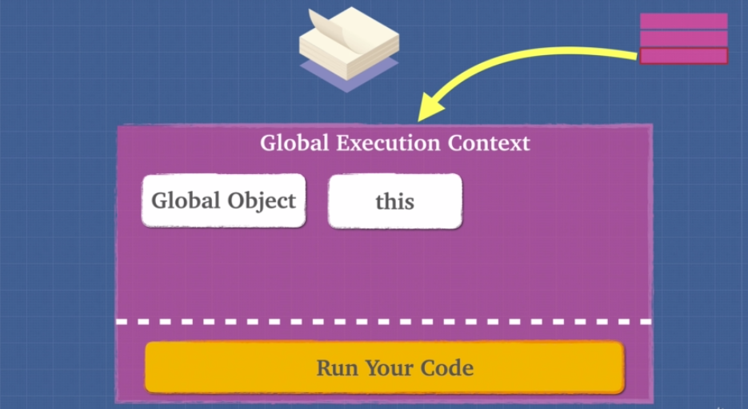 

- JS engine is going to look for function invocation and says here's a task [sayMyName()] for me and creates an execution context for it and push the execution context for [sayMyName()] in the call stack.
- Similarly, while executing [sayMyName()], it encounters [findName()] and says here's another task for me and creates an execution context for it and push the execution context for [findName()]  in the call stack and continues...
- Now all execution context poped off from call stack as the function execution completes and finally after execution of last line of our code, global execution context popped off leaving empty call stack

call stack diagram
  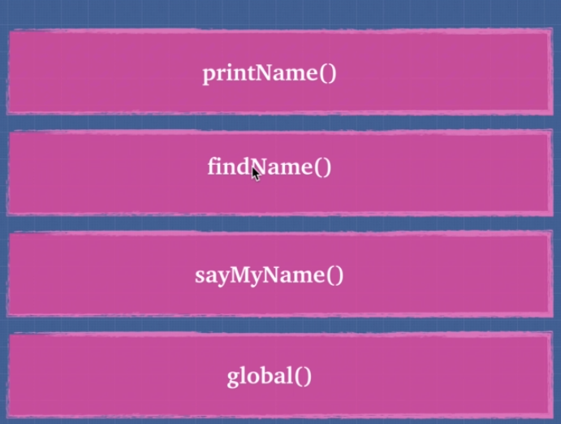{:width="36px"}

**[⬆ Back to Topics](#table-of-topics)**

---
### Lexical Environment  

**[⬆ Back to Topics](#table-of-topics)**

---
### Scope & scope chain 
#### Understanding Scope-Chain  
#### Understanding Scope [[scope]] 
#### Lexical scope Vs Dynamic scope  
#### Leakage of global variable & 'use strict' 
#### Concept of Currying 

**[⬆ Back to Topics](#table-of-topics)**

---
### Hoisting 
#### function declaration Vs function expression  
#### Variable Hoisting (**`var`**)  
#### Function Hoisting (**`function`**)  

**[⬆ Back to Topics](#table-of-topics)**

---
### Function Invokation 

**[⬆ Back to Topics](#table-of-topics)**

---
### Understanding **`this`** - **`call()`**- **`apply()`**- **`bind()`** 
#### **`this`** w.r.t. dynamic & lexical scope 
#### **`call()`** & **`apply()`** 
#### **`bind()`** 

**[⬆ Back to Topics](#table-of-topics)**

---
### Global variable & IFFE
#### Global Variable and its usage 
#### IFFE- Immediately Invoked Function Expression

**[⬆ Back to Topics](#table-of-topics)**

---