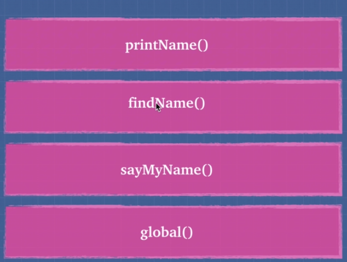
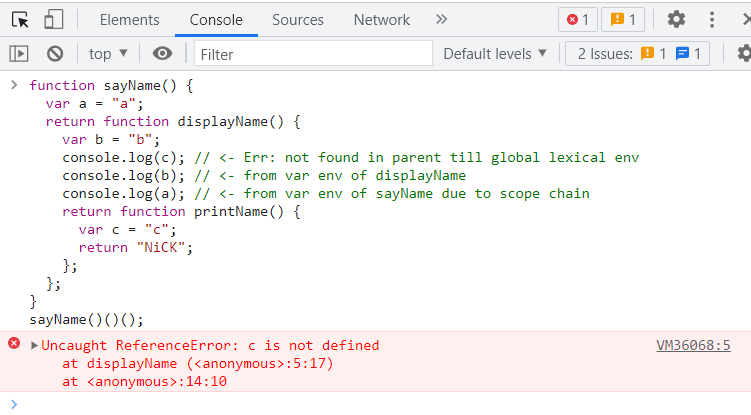

# JS - Fundamentals

This is section to get you familiar with JavaScript fundamentals concepts.

## Table of Topics
| #              | Topic                                                                                                                                                                                                                                                                                                                                                                                                                                                                                                                                                                                                                                                                                                                                                                                                                                                                                                                                                                                                                                                                                                                                                                                                                                                                                                                                                                        |
| -------------- | ---------------------------------------------------------------------------------------------------------------------------------------------------------------------------------------------------------------------------------------------------------------------------------------------------------------------------------------------------------------------------------------------------------------------------------------------------------------------------------------------------------------------------------------------------------------------------------------------------------------------------------------------------------------------------------------------------------------------------------------------------------------------------------------------------------------------------------------------------------------------------------------------------------------------------------------------------------------------------------------------------------------------------------------------------------------------------------------------------------------------------------------------------------------------------------------------------------------------------------------------------------------------------------------------------------------------------------------------------------------------------- |
| 3. Concepts    | [**JS Fundamentals**](#what-why-when-who-where-how-about-js)                                                                                                                                                                                                                                                                                                                                                                                                                                                                                                                                                                                                                                                                                                                                                                                                                                                                                                                                                                                                                                                                                                                                                                                                                                                                                                                 |
| Topics Covered | [3.1 **Execution Context**](#execution-context) <hr/>[3.2 **Lexical Environment**](#lexical-environment) <hr/>[3.3 **Scope** & **scope chain**](#scope--scope-chain)<br/>[3.3.1 Understanding Scope-Chain](#understanding-scope-chain) <br/>[3.3.2 Understanding Scope [[scope]]](#understanding-scope-scope)<br/>[3.3.3 Lexical scope Vs Dynamic scope](#lexical-scope-vs-dynamic-scope) <br/>[3.3.4 Leakage of global variable & 'use strict'](#leakage-of-global-variable--use-strict)<br/>[3.3.5 Concept of Currying](#concept-of-currying)<hr/>[3.4 **Hoisting**](#hoisting)<br/>[3.4.1 function declaration Vs function expression](#function-declaration-vs-function-expression) <br/>[3.4.2 Variable Hoisting (**`var`**)](#variable-hoisting-var) <br/>[3.4.3 Function Hoisting (**`function`**)](#function-hoisting-function) <hr/>[3.5 **Function Invokation**](#function-invokation)<hr/>[3.6 **Understanding `this`**](#understanding-this---call--apply--bind)<br/>[3.6.1 **`this`** w.r.t. dynamic & lexical scope](#this-wrt-dynamic--lexical-scope) <br/>[3.6.2 **`call()`** & **`apply()`**](#call--apply) <br/>[3.6.3 **`bind()`**](#bind)<hr/>[3.7 **Misc.**](#misc)<br/>[3.7.1 Global Variable and its usage](#global-variable-and-its-usage)<br/>[3.7.2 IFFE- Immediately Invoked Function Expression](#iffe--immediately-invoked-function-expression) |

---
## Execution Context
❓ *How do we run code in JS?*

We assign variables and then we run functions, that's all we do in JS

❓ *which example code will result in compilation error?*

eg. A
```javascript 
function printName(){    
  return "Nikhil";
}
function findName(){
    return printName();
}
function sayMyName(){
    return findName();
}
sayMyName();
```

eg. B
```javascript 
function printName(){    
  return "Nikhil";
}
function findName(){
    return printName();
}
function sayMyName(){
    return findName();
}
sayMyName()
```

- Initially our JS engine is going to create a **global execution context**  `[global()]` which says start reading the JS file and push **global execution context**  `[global()]` in call stack.

   

- JS engine is going to look for function invocation and says here's a task [sayMyName()] for me and creates an execution context for it and push the execution context for [sayMyName()] in the call stack.
- Similarly, while executing [sayMyName()], it encounters [findName()] and says here's another task for me and creates an execution context for it and push the execution context for [findName()]  in the call stack and continues...
- Now all execution context poped off from call stack as the function execution completes and finally after execution of last line of our code, global execution context popped off leaving empty call stack

call stack diagram



❓*So can I say whenever JS code executed, it will run within an execution context(can be global or some function), true or false?*

Seems to be true, what we have learnt so far. Let's deep dive to understand global execution context

Whenever Global execution context is created, it gives you 2 things
- **Global object** (**window** in case of browser | **global** in case of nodejs)
- **this**

❓*Does that mean, if execute an empty JS file, i will still be able to access window and this?*
Yes, and in global execution context

```javascript
this === window; // true in case of browser
this === gobal; // true in case of nodejs
```

Now let's say you have created a variable, and print global object. You will notice that you have added a same variable to global object. Similarly I can add functions and other things to global object 


- So far the creation phase of global execution context is completed, now execution phase executes
- Simply say, when you run JS code in JS engine, a global execution context is created and when you run a function a new execution context is created until everything is popped off from call stack and all of the code is executed

❓*What is the first execution context created when you run a JS file?*

Global execution context

**[⬆ Back to Topics](#table-of-topics)**

---
## Lexical Environment  

❓ *What does lexical means?*

Lexical means at compile time

❓ *What does Lexical Environment means?*

Lexical environment simply means **where you write something which is importan**t

❓ *Why is it important?*

Let understand with example  
```javascript
function printName() {
    return 'Nikhil';
}
function findName() {
    return printName();
}
function sayMyName() {
    return findName();
}
sayMyName();
```

Think of execution context in call stack as different planet where corresponding code is written


Now if I say that i am doing lexical analysis or compiler is performing lexical analysis, this simply means its checking where the code/words are written and their location(i.e. what planet it belongs to)

❓	*What part of universe does `printName()`, `findName()`, `sayMyName()` belongs to* 

All belongs to global planet ( global execution context)

❓ *What will be the output of below codes*

| A             | B                    |
| ------------- | -------------------- |
| `sayMyName()` | `window.sayMyName()` |
| Nikhil        | Nikhil               |


This work because all the functions including sayMyName() is part of global execution context.

eg 2
```javascript
function printName() {
    return 'Nikhil';
}
function findName() {
	function a() {

	}
    return printName();
}
function sayMyName() {
    return findName();
}
sayMyName();

```
- When the compiler/interpreter see above code, they will know different things about above code. 
- In above case, compiler finds that function a() is lexically inside function findName(). 
- This way compiler get to know the location of function a() and decides and makes decision where to put things , what actions it will take and what other function it has access to within execution context .

> Now, can we say execution context can tell us which lexical environment(universe) is running 

> In JS our lexical scope (available data + variables where the function was defined) determines our available variables. Not where the function is called (dynamic scope)

❓ *What is the first lexical environment while compiling a JS file?*

Global lexical environment (global execution context)

❓ *What is the lexical environment of function `a()` while compiling a JS file?*

findName()

> By understanding lexical environment, we are good to understand below concepts
> 1. Scope-chaining
> 2. Scope
> 3. Lexical and dynamic scope
> 4. Leakage of global scope
> 5. Currying

**[⬆ Back to Topics](#table-of-topics)**

---
## Scope & scope chain 

### Understanding Scope-Chain
eg. 1
```javascript
function sayName() {
  var a = "a";
  return displayName();
}

function displayName() {
  var b = "b";
  return printName();
}

function printName() {
  var c = "c";
  return "NiCK";
}

sayName();
```
From above example, each world(i.e. context) has a link to its outside world(or a link to its parent) and this outer environment depends on where the function sits lexically

eg 1.1

```javascript
var x = "x"; // global variable
function sayName() {
  console.log(x); // <-- accessible here or any of below function
  var a = "a";
  return displayName();
}
function displayName() {
  var b = "b";
  return printName();
}
function printName() {
  var c = "c";
  return "NiCK";
}
sayName();
```


So above function works without any error. So let's see how this works with diagram


As per the diagram
- Each function is written in global lexical environment, has its own variable environment and also has a Scope Chain that represents each function has link to its parent(i.e. access to variables and functions in global lexical environment)
- So when we assign variable x = "x", when I run printName(), console.log(x) -> it first looks in the variable environment of printName() and only sees variable c here and can't find variable x, let me go up the scope chain and see if I can find variable x (i.e. in the global lexical environment). So above function works without error

eg 2

```javascript
function sayName() {
  var a = "a";
  return function displayName() {
    var b = "b";
    return function printName() {
      var c = "c";
      return "NiCK";
    };
  };
}
```
to break it down, it has 3 scopes


### Understanding Scope [[scope]] 

Observe the diagram below, which is the same function that we have seen so far


- Now, when the function( sayName( ) ) is called and a new scope is created for the function that it entered
- Innermost environment that has some fields that belongs to variable environment in that scope but also another place that points to outer scope and then that outer scope points to its out scope until it hits the global scope
- To test out this idea, we have some thing called [[scope]]  for sayName under global object. With above function in memory, type `windows` hit enter, find sayName and expand its [[scopes]]


### Lexical scope Vs Dynamic scope  

- In JavaScript our lexical(static) scope (available data+variables where the function was defined) determines our available variables. Not where the function is called(dynamic scope)
- This is how JS engine works, while parsing the complete code its attaches these Scope chain before execution
- Scope chain starts where the variable is defined and goes all the way down to the global context to see if the variable exists that’s what scope means. Scope is variable can I access that variable


From above execution of sayName, we can say all three functions have different lexical scope
- In Ex1, All three functions have lexical scope -> Global lexical environment 
- In Ex2, lexical scope or scope chains are defined as below

as per diagram, we call it function lexical environment


So,  
> function lexical environment of sayName -> global lexical environment

> function lexical environment of displayName -> sayName

> function lexical environment of printName -> displayName


eg 2.1
```javascript
function sayName() {
  var a = "a";
  return function displayName() {
    var b = "b";
    return function printName() {
      var c = "c";
      console.log(c); // <- from var env of printName
      console.log(b); // <- from var env of displayName due to scope chain
      console.log(a); // <- from var env of sayName due to scope chain
      return "NiCK";
    };
  };
}
sayName()()();
```


eg 2.2
```javascript
function sayName() {
  var a = "a";
  return function displayName() {
    var b = "b";
    //console.log(c); // <- RefErr: not found in scope chain
    console.log(b); // <- from var env of displayName
    console.log(a); // <- from var env of sayName due to scope chain
    return function printName() {
      var c = "c";
      return "NiCK";
    };
  };
}
sayName()()();

```



But when commented


Remember, avoid below Js constructs for performance


Here with you can change how scopes and scope chain works internally in javascript
using with in our code might trick JS engine to deoptimize JS code


### Leakage of global variable & 'use strict'

eg 1
```javascript
function weird(){
  height = 50;
  return height;
}
weird(); // 50
```


❓ *Is height created in the var-env of weird?*

No, because JS is weird
Because What JS does under the hood, it looks at 'height' and observe that nothing is being declared(using var, let or const) in my var-env of weird scope. Now it goes up the scope chain tries to find height in it outer scope and look for height till it hits global scope

When it doesn't find it even in global scope, so its was created in global scope while moving up the scope

This has created a lot of issue in the earlier time when vanilla JS was used

❓ *How aforesaid issue was solved back then?*

Add 'use strict' to the top of the page. It was introduced to prevent these weird, unpredictable edge cases 

eg 1.1
```javascript
'use strict'

function weird(){
  height = 50;
  return height;
}
weird();
//Uncaught ReferenceError: height is not defined
```

eg 2
```javascript
var heyhey = function doodle(){
  return 'heyhey'
}
heyhey();  // heyhey
```


eg 2.1
```javascript
var heyhey = function doodle(){
  return 'heyhey'
}
heyhey();
doodle();
```


We get a ReferenceError, what does that mean, its nowhere seen in the scope chain. This is because the doodle() is enclosed in its own scope.ie., doodle() is added to its own execution context's var-env. That's weird right


### Concept of Currying 

Technique of customizing the evaluation of a function that takes multiple arguments into evaluating a sequence of functions each with a single argument

eg 1
```javascript
// regular function
var multiply = (a, b) => a * b;
// or
var multiply = function(a, b) {
    return a * b;
};

// ============================

// curried function
var curriedMultiply = a => b => a * b;
// or
var curriedMultiply = function (a) {
    return function (b) {
        return a * b;
    };
};

```


❓ *Create a Triple add function called as below*

```javascript
tAdd(1)(2)(3) // resulting in 6
```

**[⬆ Back to Topics](#table-of-topics)**

---
## Hoisting 

Remember, there are 2 phases of Global execution context(creation and run your code)


> These 2 phases are divided by white dotted line and in the creation phase, we have one more step i.e. **Hoisting**


❓ *What is Hoisting?*

Think of hoisting as the behaviour of moving the variable declarations and function declarations to the top of their respective usage/environments during compilation.

### Variable Hoisting (**`var`**)  
- variables are partially hoisted
### Function Hoisting (**`function`**)  
- function declarations are hoisted

Let's understand this with an example

eg 1
```javascript
console.log('1-----------');
console.log(ping);
console.log(sing());

var ping='pong';

function sing(){
    console.log('la lala la lala');
}
```


> We got the output, it doesn't work like this in strongly types languages like (c#, Java, etc)

> also when we tries to log 'ping' variables, undefined was printed in the console.

❓ *Why does the code execution without any error?*

It is due to `Hoisting`. Let's see what happened under the hood

- JS Engine that creates memory during the creation phase of your code before it executes it.
Now, during the creation phase, JS engine look through the code (start to end) and look for `var` and `function`.
- As soon as it sees these 2 keywords or operator i.e. `var` and `function` , says lemme allocate the memory because these 2 need some memory, so after creation phase JS engine looks the code in Ex1 as below


eg 2
```javascript
console.log('1-----------');

var ping = undefined;   // variable(using var) are partially hoisted

function sing(){        // function declaration are fully hoisted
  console.log('la lala la lala');
}

console.log(ping);
console.log(sing());
ping='pong';
```


Explanation

> variables declared with `var` keyword are partially hoisted and for initializes with `undefined` aka **Variable Hoisting**

> functions declaration with `function` keyword are fully hoisted aka **Function Hoisting**

> Variable hoisting and Function Hoisting happened, but not to absolute top of file but to top of respective usage/environments at compilation(creation phase) in other words, lexical scope


❓ *What will be the output of below program?*

eg 3
```javascript
console.log('1-----------');
console.log(ping);
console.log(sing());

var ping='pong';

(function sing(){
  console.log('la lala la lala');
})
```


We get ReferenceError: sing is not defined, because 

Explanation

- JS engine during compilation of code look for `var` and `function` as first keyword in order to perform hoisting.

eg 4
```javascript
console.log('1-----------');
console.log(ping);
console.log(sing());
console.log(singMore());

var ping='pong';

var singMore = function(){
  console.log('la lala ...more to come');
}

function sing(){
  console.log('la lala la lala');
}
```


Explanation brings us to another concept

### function declaration Vs function expression  

```javascript
// This is called function expression
var singMore = function() {
    console.log('la lala ...more to come');
};

// This is called function declaration
function sing() {
    console.log('la lala la lala');
}
```

This is how JS Engine looks the code after compilation phase


❓ *What will be the output of below program?*

eg 5
```javascript
console.log('1-----------');
console.log(ping);
console.log(sing());

var ping='pong';

var singMore = function(){
  console.log('la lala ...more to come');
}

console.log(singMore());

function sing(){
  console.log('la lala la lala');
}
```


Explanation

expected by reader based on learnig so far

eg 5.1
```javascript
console.log('1-----------');
console.log(ping);
console.log(sing());
console.log(singMore);

var ping='pong';

var singMore = function(){
      console.log('la lala ...more to come');
}

function sing(){
    console.log('la lala la lala');
}
```


Explanation

expected by reader based on learnig so far

eg 6
```javascript
var one = 1;
var one = 2;
console.log(one);
```


Explanation

After compilation JS Engine looks the code as below
```javascript
var one = undefined;
one = 1;
one = 2;
console.log(one);
```
- During compilation. JS Engine identify duplicate variable(s) need variable hoisting but also aware that there is already a variable hoisted with same name and ignores the Hoisting for duplicate variable(s).
- Also last assigned value to variable one is logged in the console i.e. 2

eg 7
```javascript
a();
function a(){
    console.log('Hi');
}
function a(){
    console.log('Bye');
}
```


Explanation

During Compilation, JS Engine see first a() and mind `function` keyword. It says, this needs to be hoisted. 
Now JS Engine encounters another method with same name and mind the `function` keyword and says, this needs to be hoisted, but this time he knows that memory is already allocated for a().  So it  will overwrite that memory location with implementation of second `function`

```javascript
function a(){
    console.log('Hi');
}
function a(){
    console.log('Bye');
}
a();
```


eg 8
```javascript
var favouriteFood = 'mango';

var foodThoughts = function() {
    console.log('Original favourite food:' + favouriteFood);
    var favouriteFood = 'pizza';
    console.log('New favourite food:' + favouriteFood);
};

foodThoughts();
```


Explanation: 
During compilation, JS Engine create global execution context and hoisting happen 


```javascript
var favouriteFood = undefined; // <--
var foodThoughts = undefined; // <--

favouriteFood = 'mango';
foodThoughts = function() {
    console.log('Original favourite food:' + favouriteFood);
    var favouriteFood = 'pizza';
    console.log('New favourite food:' + favouriteFood);
};
foodThoughts(); // function execution
```
During the function execution, a new execution context is created ( new little planet), AWK in the context execution creation phase, hoisting happens. Thus, JS Engine look above case as below

```javascript
var favouriteFood = undefined;
var foodThoughts = undefined;

favouriteFood = 'mango';
foodThoughts = function() {
    var favouriteFood = undefined; // <--
    console.log('Original favourite food:' + favouriteFood);
    favouriteFood = 'pizza';
    console.log('New favourite food:' + favouriteFood);
};
foodThoughts(); // function execution
```
Further its explanatin brings us to another concept

**[⬆ Back to Topics](#table-of-topics)**

---
## Function Invokation

> When a function is executed, it creates new execution context ( **this**, **arguments**, **variable environment** ) for itself.

>> Every execution context creation is followed by hoisting because of **Variable Environment**


Now there in the above example 8, writing JS code like above makes it unpredictable. I recommend avoid hoisting by not using **var** keyword and **function** keyword. 

❓ *How can you avoid Hoisting in JS code?*

> Instead of using `var` and `function` operator, we can make use modern JS feature operator like `const` and `let` and prevent any unpredictable behaviour of your code. 

eg 1
```javascript
const favouriteFood = 'mango';
const foodThoughts = function() {
  console.log('Original favourite food:' + favouriteFood);
  const favouriteFood = 'pizza';
  console.log('New favourite food:' + favouriteFood);
};
```


eg 1.1
```javascript
let favouriteFood = 'mango';
let foodThoughts = function() {
  console.log('Original favourite food:' + favouriteFood);
  let favouriteFood = 'pizza';
  console.log('New favourite food:' + favouriteFood);
};
```


❓ *What will be the output of below program?*

eg 2
```javascript
function bigBrother() {
  function littleBrother() {
    return 'it is me!';
  }
  return littleBrother();
  function littleBrother() {
    return 'no me!';
  }
}
bigBrother();
```


>> **arguments**

eg 3
```javascript
function marry(person1, person2) {
  console.log('arguments', arguments)
  return `${person1} is married to ${person2}`;
}
marry('Tim', 'Tina');
```


❓ *What happens if I try to access 'arguments' outside the function or in the global scope directly?*

eg 4
```javascript
function marry(person1, person2) {
  console.log('arguments', arguments)
  return `${person1} is married to ${person2}`;
}
marry('Tim', 'Tina');
console.log(arguments);
```


eg 5
```javascript
function marryAgain(...args) {
  console.log('arguments', arguments);
  return `${args[0]} is married to ${args[1]}`;
}
marryAgain('Tim', 'Tina');
```


eg 6
```javascript
function demoArguments() {
  console.log('arguments', arguments);
}
demoArguments();
```


❓ *Should I use `arguments` ?*

Arguments comes with performance overhead

>> **this** - is the object that a function is a property of

this brings us to another concept - **this**

**[⬆ Back to Topics](#table-of-topics)**

---
## Understanding **`this`** - **`call()`**- **`apply()`**- **`bind()`** 

> **this** - is the object that a function is a property of

this means,

```javascript
object.someFunction(this);
```

We have an `object` and this `object` has some function `someFunction` and inside of this function when we do something we have access to `this` keyword, and this refers to the `object`

> simply saying, `this` is reference to owner of someFunction 


Open dev tools, in console > `window` enter

eg 1
```javascript
window
this

function a(){
    console.log(this);
}
a();
```


- In above case, we say that this refers to global object(window) in Global Execution Context
- Don't you think this might create a confusion while development that this is pointing to global object or object under test. 
- To avoid this weirdness in JS, we make use of 'use strict';

To get clarity


eg 2
```javascript
const obj = {
  name: 'bob',
  sing:function(){
    return `${this.name} singing`;
  }
}
obj.sing();
```


❓ *Still not much clear on use of `this`*

eg 3
```javascript
const obj = {
  name: 'bob',
  sing:function(){
    return `${this.name} singing`;
  },
  singLoud(){
    return `${this.name} singing!`;
  }
}
obj.singLoud();
```


❓ *see code repetetion, how can we avoid it ?*


eg 3.1
```javascript
const obj = {
  name: 'bob',
  sing:function(){
    return `${this.name} singing`;
  },
  singLoud(){
    return `${this.sing()}!`;
  }
}
obj.singLoud();
obj.sing();
```


Advantages or purpose of this

> It gives methods to access their `object/owner` or `sibling` methods

> We can execute the same code for multiple objects


eg 4
```javascript
var firstName = 'Abha';
function superPerson(){
  console.log(this.firstName);
}
var himanshu = {
  firstName: 'Himanshu',
  superPerson : superPerson
}
var faizan = {
  firstName: 'Faizan',
  superPerson : superPerson
}
superPerson();
himanshu.superPerson();
faizan.superPerson();
```


here

- `superPerson()` behaves according to the object/owner and we are also following 100% DRY principle using `this`
- Even I need to make modification, i will make modification at only place, rest will be reflect the changes

eg 4.1
```javascript
var firstName = 'Abha';
function superPerson(){
  console.log(`Super person is ${this.firstName}`);
}
var himanshu = {
  firstName: 'Himanshu',
  superPerson : superPerson
}
var faizan = {
  firstName: 'Faizan',
  superPerson : superPerson
}
superPerson();
himanshu.superPerson();
faizan.superPerson();

```


### **`this`** w.r.t. dynamic & lexical scope 

eg 5
```javascript
var a = function() {
  console.log('a', this);
  var b = function() {
    console.log('b', this);
    var c = {
      cFunc: function() {
        console.log('c', this);
      }
    };
    c.cFunc();
  };
  b();
};
a();
```


| Who called ? | Answer   |
| ------------ | -------- |
| a()          | window   |
| b()          | window   |
| cFunc()      | c Object |

eg 5.1
```javascript
var kritika = {
  firstName : 'Kritika',
  sing(){
    console.log('sing',this);
    var lalala = function(){
      console.log('lalala', this)
    }
    lalala();
  }
}
kritika.sing();
```


| Who called ? | Answer         |
| ------------ | -------------- |
| sing()       | Kritika object |
| lalala()     | windows        |

What? This doesn't make any sense, right!!. Don't you think this within lalala() is inside the object kritika. 

❓ *Then why `this` is referring to `window` object in example 5.1?*

Because `this` keyword is not lexically scoped to its environment i.e. It doesn't matter `where it is written` but only thing that matters `is how the function was called`

So what happened is the `kritika.sing()` ran and `sing()` ran another function `lalala()`.
- `kritika` didn't really called another `lalala()`, but its was called by `sing()`. 
- And in JS, this defaults to `window` object

> In JS, our **lexical scope** ( available data + variables  where the function was defined ) determines our available variables. Not where the function is called (the `this` keyword is **dynamically scoped**)

❓ *How to solve above weird issue in JS, i.e. `this` is `dynamically scoped`?*

1. In Es6, by making use of `arrow function`, it is going to lexically bind this
eg 5.2
```javascript
var kritika = {
  firstName: 'Kritika',
  sing() {
    console.log('sing', this);
    var lalala = () => {          // <--
      console.log('lalala', this);
    };
    lalala();
  }
};
kritika.sing();
```


2. In Es5, by making use of `this` and `that`, and not `this` and `self`
eg 5.3
```javascript
var kritika = {
  firstName: 'Kritika',
  sing() {
    console.log('sing', this);
    var that = this; // <--
    var lalala = function() {
      console.log('lalala', that); // <--
    };
    lalala();
  }
};
kritika.sing();
```


- We have access to this within sing(), where this is referring to kritika object
- We can bind another reference to this and name it that
- Now within lalala(), we use that 

3. by making use of `bind()` or `IFFE` concept
eg 5.4
```javascript
var kritika = {
  firstName: 'Kritika',
  sing() {
    console.log('sing', this);
    var lalala = function() {
      console.log('lalala', this);
    };
    (lalala.bind(this))(); // <-- IFFE
  }
};
kritika.sing();
```


> `this` - can defined as
> - The object that a function is property of
> - The owner/caller of the function

> In JS, `this` defaults to `window` object

> `this` is dynamically scoped, i.e. Its reference can be determined by `how the function is called` 

> To make this lexically scoped, we can use
> - `this`-`that` technique and not `this`-`self`
> - Using `bind()`

### **`call()`** & **`apply()`** 

These are the three methods that are used to manipulate this keyword
First, let's deep dive in `call()` and `apply()`, they are similar in some sort

eg 1
```javascript
function h(){
  console.log('h called');
}
h();
h.call();
h.apply();

```


eg 2
```javascript
var wizard = {
  name: 'Merlin',
  health: 80,
  heal: function() {
      this.health = 100;
  }
};
wizard.heal();
console.log(`${wizard.name}'s health after heal: ${wizard.health}`);

var archer = {
  name:'Robin Hood',
  health : 30
}
console.log(`${archer.name}'s health before heal: ${archer.health}`);
// borrowing healing power from wizard
wizard.heal.call(archer);
console.log(`${archer.name}'s health after heal: ${archer.health}`);
```


Now let'say the method you are borrowing is taking some parameters, how we can pass arguments in a borrowed function, let's see them in action

eg 2.1
```javascript
var wizard = {
  name: 'Merlin',
  health: 80,
  heal: function(p1, p2) {
      this.health += p1+p2;
  }
};

wizard.heal(10,10);
console.log(`${wizard.name}'s health after heal: ${wizard.health}`);

var archer = {
  name:'Robin Hood',
  health : 30
}

console.log(`${archer.name}'s health before heal using call(): ${archer.health}`);

// borrowing healing power from wizard
wizard.heal.call(archer, 40, 30);
console.log(`${archer.name}'s health after heal using call(): ${archer.health}`);

// borrowing healing power from wizard
wizard.heal.apply(archer, [40, 30]);
console.log(`${archer.name}'s health after heal using apply(): ${archer.health}`);
```


### **`bind()`** 
Unlike call() and apply(),**bind method is used to borrow method from another object but does not execute it**. Execution happens on calling returned method from bind()

eg 2.2
```javascript
var wizard = {
  name: 'Merlin',
  health: 80,
  heal: function(p1, p2) {
      this.health += p1 + p2;
  }
};

wizard.heal(10, 10);
console.log(`${wizard.name}'s health after heal: ${wizard.health}`);

var archer = {
  name: 'Robin Hood',
  health: 30
};
console.log(`${archer.name}'s health before heal using call(): ${archer.health}`);

// binding wizard's healing power to archer
const healArcher = wizard.heal.bind(archer, 40, 30);

// executing borrowed method
healArcher();
console.log(`${archer.name}'s health after heal using call(): ${archer.health}`)

```


❓ *Context Vs Scope?*
| Context                                                                            | Scope                                     |
| ---------------------------------------------------------------------------------- | ----------------------------------------- |
| is often determined by, how the function is invoked with the value of this keyword | refers to the visibility of the variables |


**[⬆ Back to Topics](#table-of-topics)**

---
## Misc


### Global Variable and its usage 

Think that you wanted to keep one super secret variable in your script and it should be globally accessible within your script and there are multiple scripts attached to your application.


```html
<!DOCTYPE html>
<html lang="en">
<head>
    <meta charset="UTF-8">
    <meta name="viewport"
          content="width=device-width, initial-scale=1.0">
    <meta http-equiv="X-UA-Compatible"
          content="ie=edge">
    <title>Document</title>
    <script>var a = 5;</script>
    <script>var aa = 55;</script>
    <script>var aaaa = 555;</script>
    <script>var a = 50000;</script>
</head>
<body>
</body>
</html>
```
This is because all global variable are created under variable environment within Global Execution Context, So when the script came into play which has identical variable name with different value, it will override the value of the global variable. This might cause bugs in application working as whole and become tedious to debug.

❓ *How to solve aforesaid issue ?* 
- Modern ES6 browsers we have modules and module bundlers,
- But back then when ES6 was not there, we used IFFE to solve it 


### IFFE- Immediately Invoked Function Expression


```javascript
//IFFE syntax
1         2
⬇         ⬇
(function (){

})();
  ⬆
  3
```
Explanation
- IFFE is common JS Design pattern back when ES6 wasn't there. 
- The idea was using above IFFE pattern we can place all library/script code inside of a local scope and avoid any namespace collision 
- Lets understand above syntax first
  1. ( ) - With these brackets in the beginning, we are saying that this isn't a function expression. This is a function expression
  2. ( ) - anonymous function is attached to function expression created at #1
  3. ( ) - Parenthesis in the last, instructs JS engine to invoke the function immediately 

❓ *So can I call function declaration immediately?*

Ex ---> function (){}(), this will result in error

```javascript
// IFFE syntax
(function (){

}());
```
Above code snippet is a valid IFFE, because its again a function expression and I am immediately calling the anonymous function.

Let see how this solve global env polluting issue,
eg 1
```html
<!DOCTYPE html>
<html lang="en">
<head>
    <meta charset="UTF-8">
    <meta name="viewport"
          content="width=device-width, initial-scale=1.0">
    <meta http-equiv="X-UA-Compatible"
          content="ie=edge">
    <title>Document</title>
    <script>
        var a = 5;
        function a(){
            return 5;
        }
    </script>
    <script>var aa = 55;</script>
    <script>var aaaa = 555;</script>
    <script>
        var a = 50000;
        function a(){
            return 5;
        }
    </script>
</head>
<body>
</body>
</html>
```

eg 1.1
```html
<!DOCTYPE html>
<html lang="en">
<head>
    <meta charset="UTF-8">
    <meta name="viewport"
          content="width=device-width, initial-scale=1.0">
    <meta http-equiv="X-UA-Compatible"
          content="ie=edge">
    <title>Document</title>
    <script>
        var a = 5;        
        var script1 = (function () {
            function b() {
                return 5;
            };
            return{
                b:b,
            };
        });
    </script>
    <script>var aa = 55;</script>
    <script>var aaaa = 555;</script>
    <script>
        var a = 50000;
        function a(){
            return 5;
        }
    </script>
</head>
<body>
</body>
</html>
```


- Now, we have created a namespace, which can have any variable names that will be local to that namespace ( script1 ). script1 is still polluting global environment, but only once

- Similarly we can have created different namespaces for multiple scripts and this helps in avoiding the issue of pollution global env

- IFFE is the basic concept behind the birth of JQuery

eg 1.2
```html
<!DOCTYPE html>
<html lang="en">
<head>
    <meta charset="UTF-8">
    <meta name="viewport"
          content="width=device-width, initial-scale=1.0">
    <meta http-equiv="X-UA-Compatible"
          content="ie=edge">
    <title>Document</title>
</head>
<body>
    <h1 id="head">Click me</h1>

    <script src="https://code.jquery.com/jquery-3.4.1.min.js"
            integrity="sha256-CSXorXvZcTkaix6Yvo6HppcZGetbYMGWSFlBw8HfCJo="
            crossorigin="anonymous"></script>

    <script>
        var a = 5;
        var script1 = (function () {
            function b() {
                return 5;
            };
            $('#head').click(() => { //<-- $
                $('#head').hide();
            });
            return {
                b: b,
            };
        })();
    </script>
    <script>var aa = 55;</script>
    <script>var aaaa = 555;</script>
    <script>
        var a = 50000;
        function a(){
            return 5;
        }
    </script>

</body>
</html>
```


after click


> There is scope of performance improvement, since we are referring $ within an IFFE and $ was never declared within IFFE, it will look up the scope and finds it and then uses it.

❓ *Can I parameterized an IFFE ?*

Yes

eg 2
```html
!DOCTYPE html>
<html lang="en">
<head>
    <meta charset="UTF-8">
    <meta name="viewport"
          content="width=device-width, initial-scale=1.0">
    <meta http-equiv="X-UA-Compatible"
          content="ie=edge">
    <title>Document</title>
</head>
<body>
    <h1 id="head">Click me</h1>

    <script src="https://code.jquery.com/jquery-3.4.1.min.js"
            integrity="sha256-CSXorXvZcTkaix6Yvo6HppcZGetbYMGWSFlBw8HfCJo="
            crossorigin="anonymous"></script>

    <script>
        var a = 5;
        var script1 = (function (OMG) { //<--
            function b() {
                return 5;
            };
            OMG('#head').click(() => {
                OMG('#head').hide();
            });
            return {
                b: b,
            };
        })(jQuery); //<--
    </script>
    <script>var aa = 55;</script>
    <script>var aaaa = 555;</script>
    <script>
        var a = 50000;
        function a(){
            return 5;
        }
    </script>

</body>
</html>
```


after click


> But this time, when accessing `$` or `jQuery`, this time we get some speed boosted because we are not doing scope lookup


> IFFE creates a fresh environment for us

> IFFE helps in creating namespaces

>IFFE enables us to assign private data to a function, thus avoid polluting global execution context

>IFFE help to scope relevant things into their scoped environment

**[⬆ Back to Topics](#table-of-topics)**


---
